# Cyber Apocalypse CTF 2025: Tales from Eldoria Writeup Part.3

## Intro

> **WARNING: This writeup is using Non-standard solution, it's not official correct way to solve this challenge, please check: [Official Writeup](https://github.com/hackthebox/cyber-apocalypse-2025/blob/main/reversing/%5BHard%5D%20Gateway/README.md)**
> 
> **Some of the assumptions and conclusions in this writeup are wrong or based on incorrect premises.**
> 
> **It is highly recommended to read the official writeup before reading this writeup.**

> 2025/03/28 Update(After reading official writeup): WTF??? Come on, challenge author, how many challengers would go through the complete source code of the Linux kernel x86 architecture and conduct an in-depth analysis, let alone such an unpopular technology?? 
> 
> The author assumes that all challengers know about the x86/x64 runtime transitions in the Linux kernel source code or the (extremely uncommon) Heavensgate feature under Linux (segment selector behavior that depends on architecture and platform specific values).
> 
> This is why it is extremely difficult to solve this challenge by the usual path, and it is almost never a standard solution.

After solving the first four easy challenges and spending several hours overnight for the 'medium difficulty' but actually 'difficulty-fraudulent' `Singlestep` (whose solve count hovered around 200, similar to `Gateway`), it was already 05:22 (GMT+9) on the deadline day, less than 17 hours before the deadline at 22:00 (GMT+9). Next up was `Gateway`, the hardest challenge apart from `HeartProtector` (37 solves, less than 0.5% team solve rate), which was also my final goal for this CTF. As mentioned before, because I only remembered this competition on the last day, I had less than 25 hours left when I started, so this was the last reverse engineering challenge I focused on.

> Notice:
> 
> At the time of the my submission (1 hour and 45 minutes before the deadline), the total solve count ratio was 171/8.1k (team ratio) or 171/18k (individual ratio). If considering only reverse engineering challenges category, it was 171/2272 (team ratio).
> When I started, the total solve count ratio was 74/8.1k (team ratio) or 74/18k (individual ratio). If considering only reverse engineering challenges category, it was 74/2272 (team ratio).

> Notice:
> 
> During GDB debugging, I used `x/16dx` or `x/16dd` to display 16 elements of 32-bit memory. In reality, the correct usage should be `x/16wx` or `x/16wd`. Although my usage didn't cause errors (the format flag at the end actually overrides the preceding one), don't pick up this bad habit. I will correct this after this time.

## Reverse Part.0: Reconnaissance

First, as usual, let's use DIE to check the platform, compiler, and protection information.

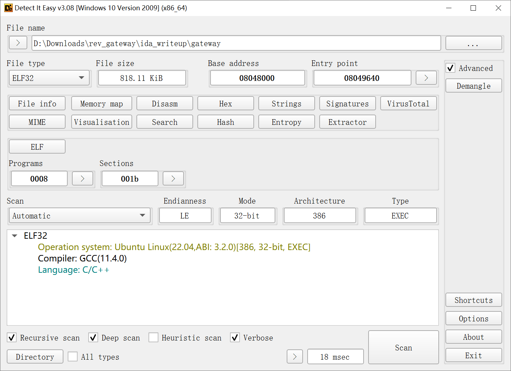

Just like the previous challenges, it's an ELF binary, no protection. But unlike the others, this is a 32-bit program, so IDA32 must be used for analysis.

So, the initial goals remain the same:

1.  Find the entry point and the vicinity of the decryption logic through `read()` or `printf()`.
2.  De-obfuscate if obfuscation is encountered.
3.  After de-obfuscation, analyze the flag validation logic, Capture The Flag.

So, it's time to act. First, let's analyze it with IDA32.

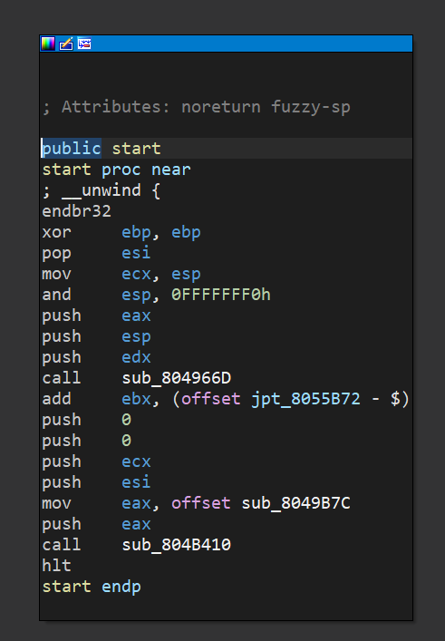

A standard `start` entry point, but `main` wasn't identified. Also somewhat unusual is the use of `hlt` and a GOT/PLT table pointer. Ignore these for now, let's try decompile it.

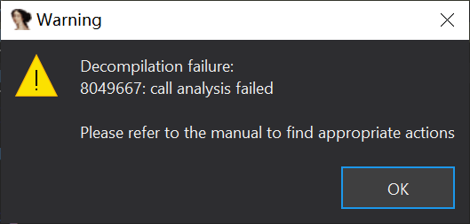

As expected, decompilation failure; `start` is obfuscated. Clicking into several `call`s revealed mostly stack pointer analysis failures and meaningless code. At this point, I felt that following `start` seemed unlikely to yield results, so I decided to use the alternative plan: library function breakpoint analysis. Unfortunately, the challenge author anticipated this; the program uses static linking, there are no imported names, and `printf` itself is not directly called within the statically linked library, so this path was completely blocked.

## Reverse Part.1: Entry Point Finding

### take1

Although I couldn't find `printf` through symbols, `printf` itself still needs to use system calls to send output to `stdio`. So I planned to use `strace` to find the call stack during `syscall`s, and thus locate `printf`.

```sh
strace -k ./gateway
 > unexpected_backtracing_error [0x66b0]
[ Process PID=2679 runs in 32 bit mode. ]
```

However, reality hit me hard. `strace` did trace the calls, but `backtrace` failed—`strace` does not support call stack tracing for 32-bit programs in a 64-bit environment.

> 2025/03/28 Update: It seems more like after switching to 64-bit mode, strace is tracing incorrectly with the premise of a 32-bit program, thus causing the failure.

At this point, it was already 6 AM, less than 16 hours before the deadline. I couldn't risk another failure by setting up a 32-bit environment on the spot, so this path was also blocked.

### take2

Since external analysis didn't work, and internal static analysis didn't either, what about dynamic analysis?

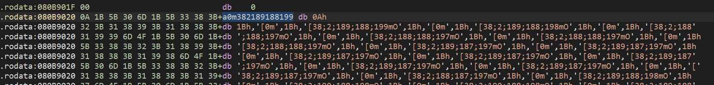

Search for strings. Although static analysis can't find cross-references, memory breakpoints can find access locations and call stacks during dynamic analysis.

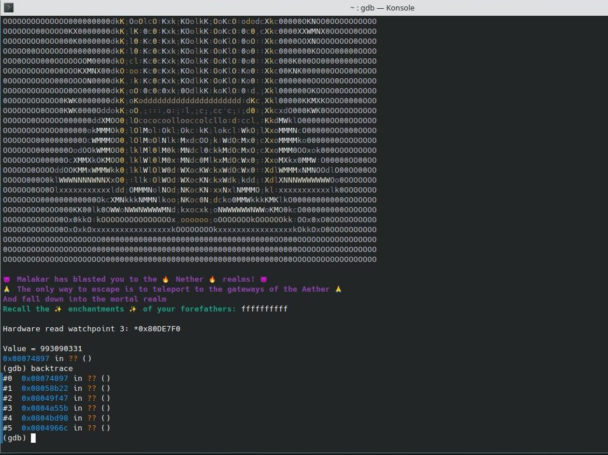

Success! Using memory breakpoints, I found the location of the `printf` internal implementation. Following the call stack upwards, I finally found the function where the main logic resides.

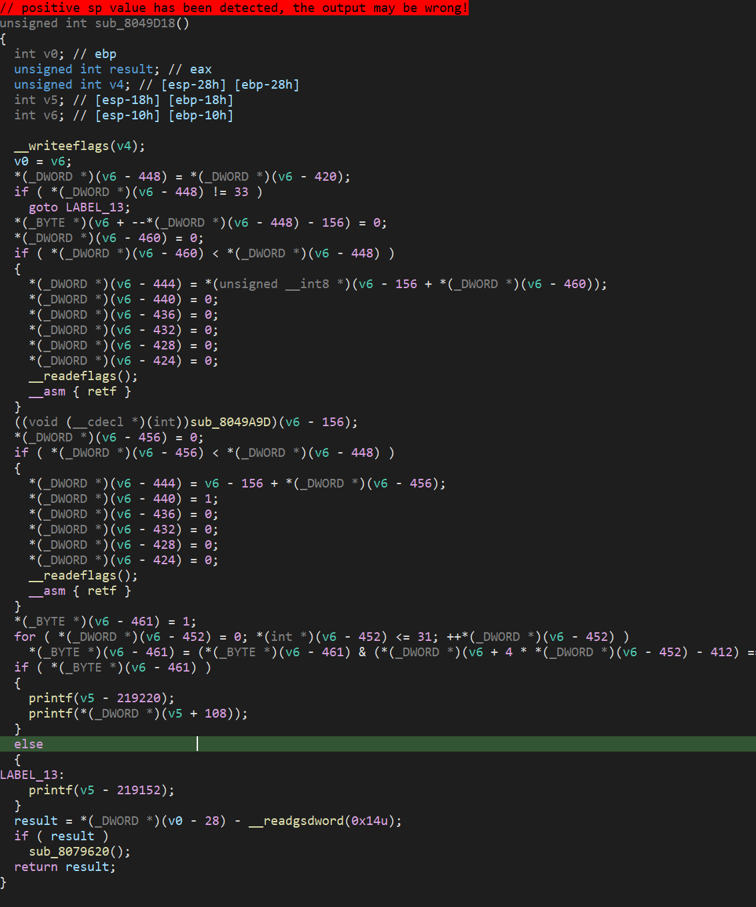

The first problem was thus solved. But the second problem followed immediately: various inserted assembly instructions and confusing pointer analysis made the pseudocode of this function completely unreadable. Now it's time to move to the second step - de-obfuscation.

## Reverse Part.2: De-obfuscation & Initial Logic Analysis

### Initial De-obfuscation

After finding the main logic function, entering various function calls and `jmp`s unsurprisingly yielded nothing. So next, I decided to seriously start analyzing the obfuscation.

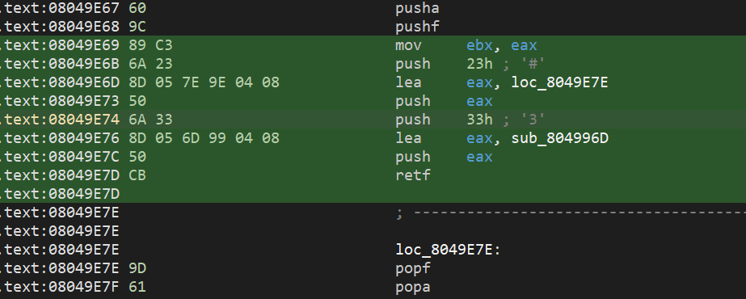

After some analysis, I noticed a widely present pattern:

```assembly
pusha
pushf
mov ebx, eax
push 0x23
lea eax, loc_xxx
push eax
push 0x33
lea eax, sub_xxx
push eax
retf

loc_xxx:
popf
popa
...
```

It was precisely this unusual pattern that broke the call chain analysis, so we need to analyze this pattern in detail.

```assembly
pusha ; Save environment - General registers
pushf ; Save environment - Flag register
mov ebx, eax ; Save current eax
push 0x23	; Segment selector, for return
lea eax, loc_xxx ; Get return address
push eax ; Push return address
push 0x33 ; Segment selector, for call
lea eax, sub_xxx ; Get call address
push eax ; Push call address
retf ; Use retf to implement a call to the target address, then return to the return address

loc_xxx:
popf ; Restore environment - Flag register
popa ; Restore environment - General registers
...
```

> 2025/03/28 Update(After reading official writeup): A value of 0x23 causes the program to execute in 32 bit mode, while a value of 0x33 causes the program to execute in 64 bit mode.

After some analysis, the purpose of this pattern becomes clear - it's a `call` implemented using `retf` and `far proc`. Therefore, we can simply replace it with a `call`, but the problem is we don't know how many instances of this pattern exist yet, so pattern matching is needed.

Therefore, I wrote the following IDA Python script for searching:

```python
import ida_bytes
import ida_segment
import ida_ua
import ida_nalt
import ida_funcs
import idc

# --- Configuration ---
# Target segment name
SEGMENT_NAME = ".text"

# --- Obfuscation pattern byte sequence ---
# pushad         (60)
# pushfd         (9C)
# mov ebx, eax   (89 C3)
# push 23h       (6A 23)
# lea eax, ret_addr (8D 05 XX XX XX XX)
# push eax       (50)
# push 33h       (6A 33)
# lea eax, target_addr (8D 05 YY YY YY YY)
# push eax       (50)
# retf           (CB)

PATTERN_START_BYTES = [0x60, 0x9C, 0x89, 0xC3, 0x6A, 0x23, 0x8D, 0x05] # Starting 8 bytes
PATTERN_MIDDLE_BYTES = [0x50, 0x6A, 0x33, 0x8D, 0x05] # Middle 5 bytes (push eax, push 33h, lea eax)
PATTERN_END_BYTES = [0x50, 0xCB] # Final 2 bytes (push eax, retf)

# Return point pattern
RETURN_PATTERN_BYTES = [0x9D, 0x61] # popfd, popad

def patch_obfuscated_retf():
    searched_count = 0
    seg = ida_segment.get_segm_by_name(SEGMENT_NAME)
    if not seg:
        print("Error: Cannot find segment '{}'".format(SEGMENT_NAME))
        return

    print("Starting search for obfuscation pattern in segment '{}' (0x{:X} - 0x{:X})...".format(
        SEGMENT_NAME, seg.start_ea, seg.end_ea))

    ea = seg.start_ea
    while ea < seg.end_ea:
        # 1. Match pattern start
        match = True
        for i, b in enumerate(PATTERN_START_BYTES):
            if ida_bytes.get_byte(ea + i) != b:
                match = False
                break
        if not match:
            ea += 1
            continue

        # 2. Extract return address offset (in lea eax, ret_addr instruction)
        # PATTERN_START_BYTES length is 8
        ret_addr_offset_ea = ea + 8 # lea instruction address
        ret_addr = ida_bytes.get_dword(ret_addr_offset_ea) # Operand is DWORD address

        # 3. Match pattern middle part
        middle_start_ea = ea + 8 + 4 # After the first lea instruction
        match = True
        for i, b in enumerate(PATTERN_MIDDLE_BYTES):
            if ida_bytes.get_byte(middle_start_ea + i) != b:
                match = False
                break
        if not match:
            print("Warning: Found pattern start at 0x{:X}, but middle part doesn't match. Skipping.".format(ea))
            ea += 1
            continue

        # 4. Extract target address offset (in the second lea eax, target_addr instruction)
        # PATTERN_MIDDLE_BYTES length is 5
        target_addr_offset_ea = middle_start_ea + 5 # Second lea instruction address
        target_addr = ida_bytes.get_dword(target_addr_offset_ea) # Operand is DWORD address

        # 5. Match pattern end
        end_start_ea = middle_start_ea + 5 + 4 # After the second lea instruction
        match = True
        for i, b in enumerate(PATTERN_END_BYTES):
            if ida_bytes.get_byte(end_start_ea + i) != b:
                print(i, hex(b), hex(ida_bytes.get_byte(end_start_ea + i)))
                print()
                match = False
                break
        if not match:
            print("Warning: Found pattern start and middle at 0x{:X}, but end part doesn't match. Skipping.".format(ea))
            ea += 1
            continue

        # --- Full pattern match successful ---
        pattern_start_ea = ea
        pattern_end_ea = end_start_ea + len(PATTERN_END_BYTES) # Address after retf instruction
        pattern_len = pattern_end_ea - pattern_start_ea
        print("Found complete obfuscation pattern at 0x{:X} (length {} bytes):".format(pattern_start_ea, pattern_len))
        print("  -> Target address: 0x{:X}".format(target_addr))
        print("  -> Return address: 0x{:X}".format(ret_addr))

        # 6. Calculate call relative offset
        call_instr_len = 5 # E8 XX XX XX XX
        addr_after_call = pattern_start_ea + call_instr_len
        relative_offset = target_addr - addr_after_call

        print("  [Info] Need to write call 0x{:X} (relative offset 0x{:X}) at 0x{:X} and fill with {} NOPs".format(
            pattern_start_ea, target_addr, relative_offset & 0xFFFFFFFF, pattern_len - call_instr_len))

        if ida_bytes.get_byte(ret_addr) == RETURN_PATTERN_BYTES[0] and \
           ida_bytes.get_byte(ret_addr + 1) == RETURN_PATTERN_BYTES[1]:
                print("  [Info] Need to NOP popfd/popad at 0x{:X}".format(ret_addr))
        else:
            print("  Warning: popfd/popad not found at expected return address 0x{:X} (bytes: 0x{:02X} 0x{:02X}). Return point not modified.".format(
                ret_addr, ida_bytes.get_byte(ret_addr), ida_bytes.get_byte(ret_addr + 1)))

        # 7. Update counter
        searched_count += 1

        # Continue searching after the found instruction
        ea = pattern_start_ea + call_instr_len
        continue # Continue while loop

        # If full pattern not found, continue to next byte
        ea += 1

    print("Search complete. Found {} obfuscation instances in total.".format(searched_count))

# --- Execute script ---
patch_obfuscated_retf()
```

Execution Result:

```
Starting search for obfuscation pattern in segment '.text' (0x80490A0 - 0x80B7E07)...
Found complete obfuscation pattern at 0x8049AF7 (length 23 bytes):
  -> Target address: 0x8049A05
  -> Return address: 0x8049B0E
  [Info] Need to write call 0x8049A05 (relative offset 0xFFFFFF09) at 0x8049AF7 and fill with 18 NOPs
  [Info] Need to NOP popfd/popad at 0x8049B0E
Found complete obfuscation pattern at 0x8049C34 (length 23 bytes):
  -> Target address: 0x80499B9
  -> Return address: 0x8049C4B
  [Info] Need to write call 0x80499B9 (relative offset 0xFFFFFD80) at 0x8049C34 and fill with 18 NOPs
  [Info] Need to NOP popfd/popad at 0x8049C4B
Found complete obfuscation pattern at 0x8049D01 (length 23 bytes):
  -> Target address: 0x80498D5
  -> Return address: 0x8049D18
  [Info] Need to write call 0x80498D5 (relative offset 0xFFFFFBCF) at 0x8049D01 and fill with 18 NOPs
  [Info] Need to NOP popfd/popad at 0x8049D18
Found complete obfuscation pattern at 0x8049DAC (length 23 bytes):
  -> Target address: 0x8049A51
  -> Return address: 0x8049DC3
  [Info] Need to write call 0x8049A51 (relative offset 0xFFFFFCA0) at 0x8049DAC and fill with 18 NOPs
  [Info] Need to NOP popfd/popad at 0x8049DC3
Found complete obfuscation pattern at 0x8049E67 (length 23 bytes):
  -> Target address: 0x804996D
  -> Return address: 0x8049E7E
  [Info] Need to write call 0x804996D (relative offset 0xFFFFFB01) at 0x8049E67 and fill with 18 NOPs
  [Info] Need to NOP popfd/popad at 0x8049E7E
Search complete. Found 5 obfuscation instances in total.
```

As the results show, there weren't many instances obfuscated this way, so I chose to patch them manually.

> Notice: This script is only for searching and does not replace any instructions.

After patching, there were still some issues to fix. Because IDA initially analyzed the function layout incorrectly (as shown below), we need to manually merge some functions.

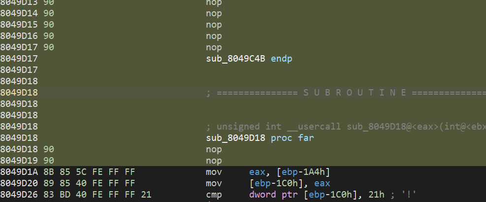

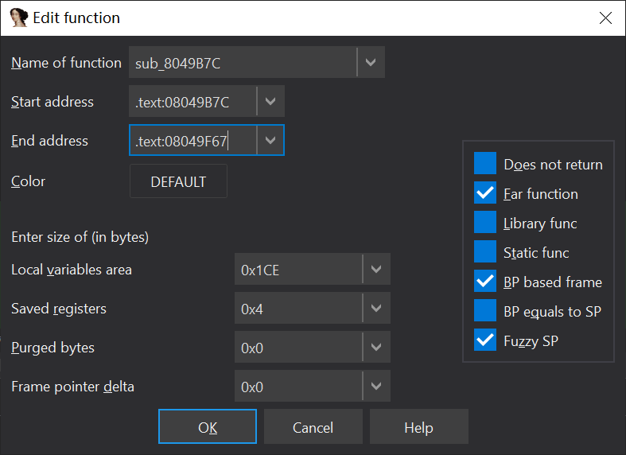

Now we have a mostly clear main logic function:

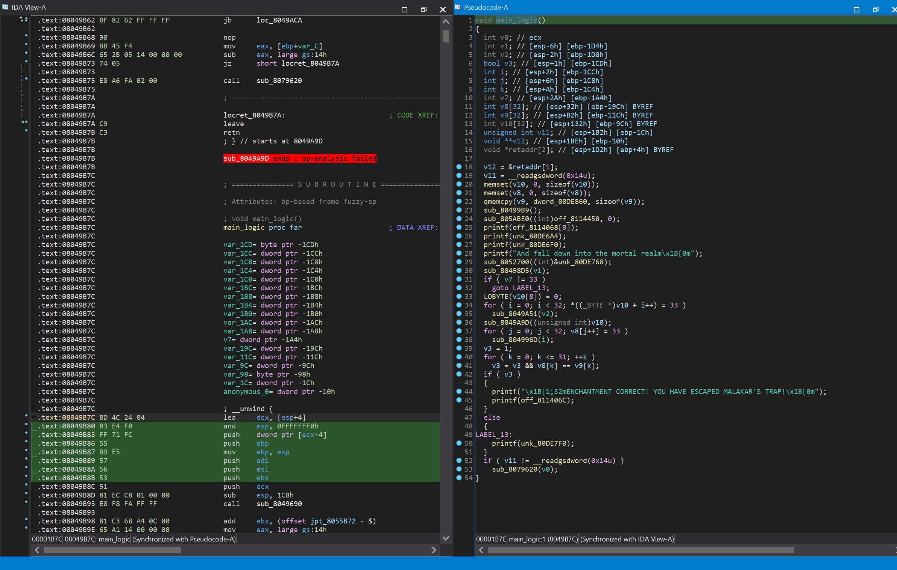

After further fixing and analysis, we got the following pseudocode:

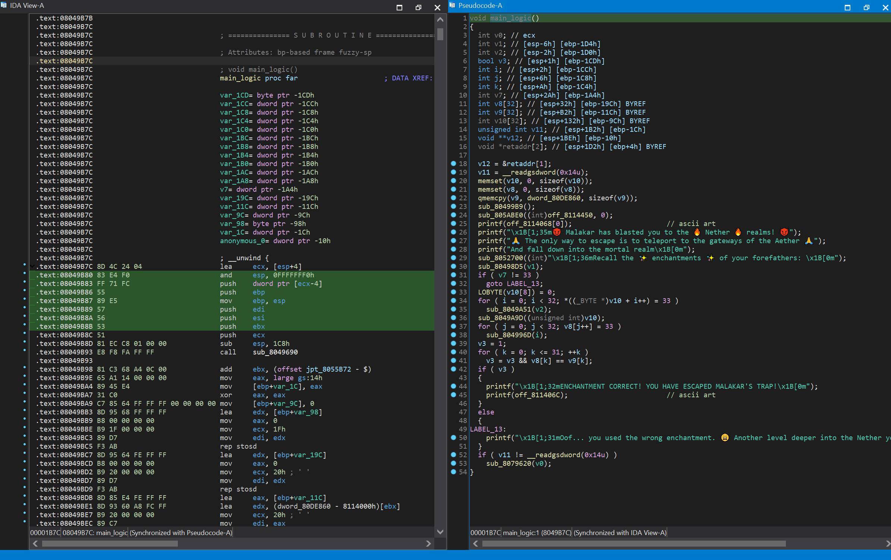

### Removing Useless Code

First, let's ignore

```c
if ( v11 != __readgsdword(0x14u) )
    sub_8079620(v0);
```

This is the stack overflow canary, unrelated to the actual logic.

Second, let's simplify away the `printf` at the beginning, which is unrelated to the main logic.

Through dynamic debugging, we can further determine that `sub_80499B9` and `sub_805ABE0` are also calls unrelated to the main logic, so ignore them too.

`v12 = &retaddr[1];` is a statement with no actual effect, so we ignore it as well.

Therefore, we can further obtain the following pseudocode:

```c++
void main_logic()
{
  int v1; // [esp-6h] [ebp-1D4h]
  int v2; // [esp-2h] [ebp-1D0h]
  bool v3; // [esp+1h] [ebp-1CDh]
  int i; // [esp+2h] [ebp-1CCh]
  int j; // [esp+6h] [ebp-1C8h]
  int k; // [esp+Ah] [ebp-1C4h]
  int v7; // [esp+2Ah] [ebp-1A4h]
  int v8[32]; // [esp+32h] [ebp-19Ch] BYREF
  int v9[32]; // [esp+B2h] [ebp-11Ch] BYREF
  int v10[32]; // [esp+132h] [ebp-9Ch] BYREF

  memset(v10, 0, sizeof(v10));
  memset(v8, 0, sizeof(v8));
  qmemcpy(v9, dword_80DE860, sizeof(v9));
  sub_80498D5(v1);
  if ( v7 != 33 )
    goto LABEL_13;
  LOBYTE(v10[8]) = 0;
  for ( i = 0; i < 32; *((_BYTE *)v10 + i++) = 33 )
    sub_8049A51(v2);
  sub_8049A9D((unsigned int)v10);
  for ( j = 0; j < 32; v8[j++] = 33 )
    sub_804996D(i);
  v3 = 1;
  for ( k = 0; k <= 31; ++k )
    v3 = v3 && v8[k] == v9[k];
  if ( v3 )
  {
    printf("\x1B[1;32mENCHANTMENT CORRECT! YOU HAVE ESCAPED MALAKAR'S TRAP!\x1B[0m");
    printf(off_811406C); // ascii art
  }
  else
  {
LABEL_13:
    printf("\x1B[1;31mOof... you used the wrong enchantment. 😩 Another level deeper into the Nether you go! 😩\x1B[0m");
  }
}
```

First, let's analyze the main verification part:

```c
  if ( v3 )
  {
    printf("\x1B[1;32mENCHANTMENT CORRECT! YOU HAVE ESCAPED MALAKAR'S TRAP!\x1B[0m");
    printf(off_811406C);
  }
  else
  {
LABEL_13:
    printf("\x1B[1;31mOof... you used the wrong enchantment. 😩 Another level deeper into the Nether you go! 😩\x1B[0m");
  }
```

This clearly indicates that `v3` is the flag indicating whether the flag is correct. So let's see how `v3` is obtained:

```c
  v3 = 1;
  for ( k = 0; k <= 31; ++k )
    v3 = v3 && v8[k] == v9[k];
```

Obviously, the logic here is to compare the elements of the two `int` arrays `v8` and `v9` one by one, and `v9` is a copy of a constant array `dword_80DE860`. If any element differs, `v3` becomes false; otherwise, it remains true.

Then, we notice that `LABEL_13` is a label pointing to the validation failure branch, and it is used in the following part:

```c
  if ( v7 != 33 )
    goto LABEL_13;
```

Combining this with the loop counts, we can infer that `v7` is the input length, and `33` is the constant value for the expected length. Also, considering the newline character, the actual length is 33-1=32.

So the next questions are: Where is the input read from? And where does `v7` come from?

To solve this, we need to look at the function calls before `v7` is checked. Apart from the clearly unsuitable `memset`/`qmemcpy`, only the function `sub_80498D5` remains.

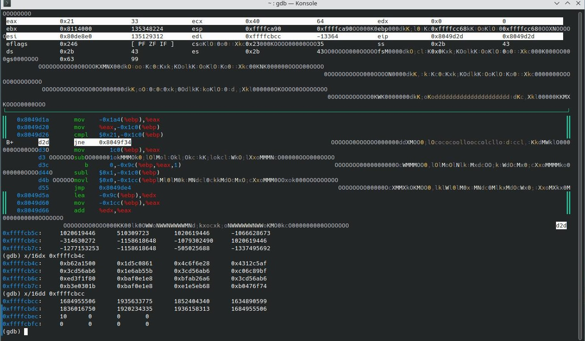

By tracing variables through static analysis, we can clearly see this change. Through analysis, we can draw the following conclusions:

```
0xffffcacc == v8
0xffffcb4c == v9
0xffffcbcc == v10
```

And after the `sub_80498D5` function call, `0xffffcbcc` (where `v10` is located) is filled with the content of the input char array, and the stack address where `v7` resides is assigned the input length.

Therefore, we can consider `sub_80498D5` as the input reading function, and `v10` as the user input byte array.

Then, the next statement is `LOBYTE(v10[8]) = 0;`. Considering that `v10` was incorrectly parsed as an `int` type, this statement is actually equivalent to `((char*)v10)[32] = 0`. It's clear that this statement converts the input newline character into the standard string terminator `\0`.

Thus, after further simplification and analysis, we obtain the following pseudocode:

```c
void main_logic()
{
  int v1; // [esp-6h] [ebp-1D4h]
  int v2; // [esp-2h] [ebp-1D0h]
  int length; // [esp+2Ah] [ebp-1A4h]
  int v8[32]; // [esp+32h] [ebp-19Ch] BYREF
  int check_arr[32]; // [esp+B2h] [ebp-11Ch] BYREF
  char user_input[32 * 4]; // [esp+132h] [ebp-9Ch] BYREF

  memset(user_input, 0, sizeof(user_input));
  memset(v8, 0, sizeof(v8));
  qmemcpy(check_arr, &unk_80DE860, sizeof(check_arr));
  read(v1);
  if ( length != 33 )
    goto FAILED;
  int i = 0;
  for ( i = 0; i < 32; user_input[i++] = 33 )
    sub_8049A51(v2);
  sub_8049A9D(user_input);
  user_input[32] = 0;
  for ( int j = 0; j < 32; v8[j++] = 33 )
    sub_804996D(i);
  bool is_valid = 1;
  for ( int k = 0; k <= 31; ++k )
    is_valid = is_valid && v8[k] == check_arr[k];
  if ( is_valid )
  {
    printf((int)"\x1B[1;32mENCHANTMENT CORRECT! YOU HAVE ESCAPED MALAKAR'S TRAP!\x1B[0m");
    printf((int)off_811406C);                   // ascii art
  }
  else
  {
FAILED:
    printf((int)"\x1B[1;31mOof... you used the wrong enchantment. 😩 Another level deeper into the Nether you go! 😩\x1B[0m");
  }
}
```

With this, we have initially completed the logic sorting and de-obfuscation of the main logic function, but there are still many questions unanswered. Next, we finally enter the final stage - analyzing the flag verification logic and reverse deriving it.

By the time I reached this step, it was already around 9:00 (GMT+9) that day, about 13 hours remaining before the deadline. And the remaining work seemed to be just analyzing the flag validation logic and then performing reverse calculations to recover the flag. This shouldn't be too complicated... right? Excited by the intermediate success at the time, I didn't know that the real nightmare and pitfalls were just beginning, and this would nearly push me to the brink.

## Reverse Part.3 Core Flag Validation Logic Analysis

Finally, the main event. Let's start the final and most core part - the analysis of the flag validation logic.

First, as mentioned above, we actually already know the `v8` that the program expects. So now we have several core questions:

1.  How is `v8` obtained?
2.  What happens between the two loops?

First, let's focus our attention on the following part:

```c
  int i = 0;
  for ( i = 0; i < 32; user_input[i++] = 33 )
    sub_8049A51(v2);
  sub_8049A9D(user_input);
  for ( int j = 0; j < 32; v8[j++] = 33 )
    sub_804996D(i);
```

By observation, we can see that these two loops update `user_input` and `v8` respectively, and there is also an unknown function `sub_8049A9D` called once outside the loops, taking `user_input` as input. Let's analyze step by step in order.

First, let's recall the variable address correspondence obtained from dynamic debugging earlier (under the new names):

```
0xffffcacc == v8
0xffffcb4c == check_arr
0xffffcbcc == user_input
```

First is the first loop:

```c
  for ( i = 0; i < 32; user_input[i++] = 33 )
    sub_8049A51(v2);
```

Let's analyze it step by step:

First, before the loop, `user_input` is the ASCII character sequence entered by the user.

Taking `"random_stringsrandom_stringsrand"` as an example, `user_input` is the following content:

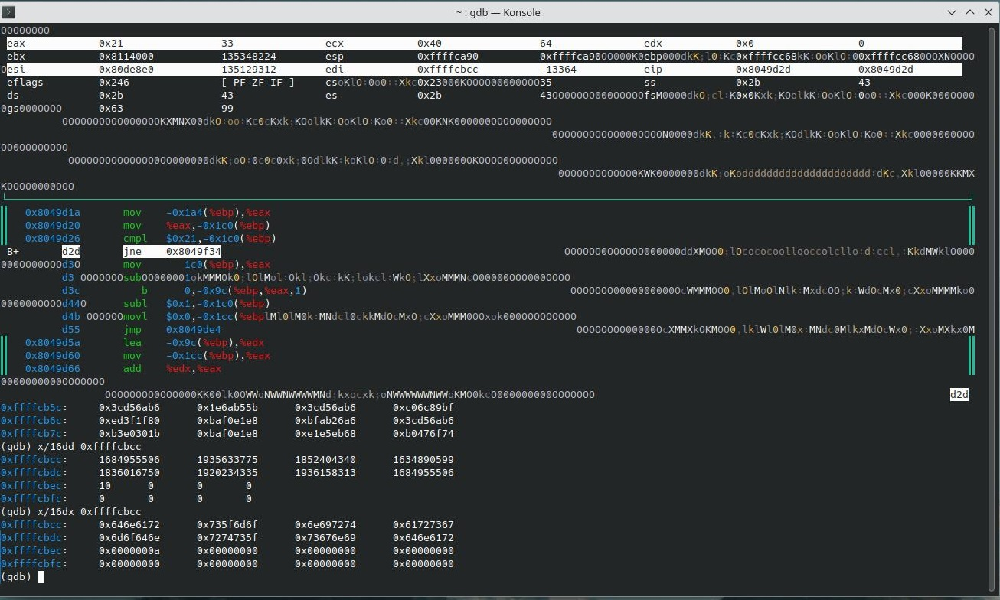

Running through dynamic debugging until after the loop execution, we get the following result:

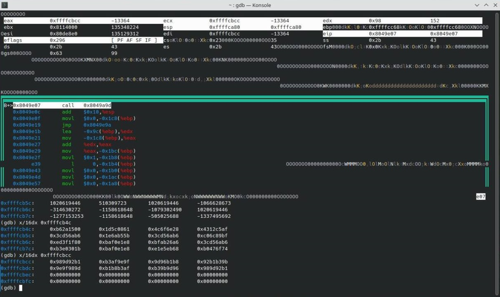

It can be clearly seen that user_input has undergone some kind of transformation.

But using memory breakpoints, we located the assignment statement within the loop at `for ( i = 0; i < 32; user_input[i++] = 33 )`. This is equivalent to:

```c
  for ( i = 0; i < 32; ++i )
  {
      sub_8049A51(v2);
      user_input[i] = 33;
  }
```

From the pseudocode, the expected value seems to be an array filled entirely with `33`, but why did we get a different result? Let's look at the corresponding assembly code:

```assembly
mov     eax, [ebp+length]	; Move the value of the length variable to eax
mov     edx, eax	; Move eax to edx
lea     ecx, [ebp+user_input_base]	; Move the address of user_input (on the stack) to ecx
mov     eax, [ebp+loop_count]	; Move the loop count value to eax
add     eax, ecx	; Loop count + base offset, get the address of the current element (eax)
mov     [eax], dl	; Move the low byte of edx to the address in eax
add     [ebp+loop_count], 1	; Increment counter
```

Looking at the assembly, it becomes obvious: `33` is actually IDA incorrectly simplifying the value of `length` and displaying it as a constant assignment.

Why did this happen? The problem actually stems from this statement:

```c
  if ( length != 33 )
    goto FAILED;
```

The statement we are currently analyzing is before the `FAILED` label, and `length` has no other assignment statements within the current function, so IDA naturally assumes that `length` must be `33` in this execution flow, leading to the simplification above, which is also known as "constant propagation" or "constant folding".

So, based on our corrected understanding, it should actually be converted to:

```c
  for ( i = 0; i < 32; ++i )
  {
      sub_8049A51(v2);
      user_input[i] = length;
  }
```

So when does `length` change? Obviously, it's after the call to `sub_8049A51`. So let's enter this function to trace and set memory breakpoints.

### First Loop

> **WARNING: Before you reading this part, please understand: Most of this part should actually be based on x86-64 analysis, while the following content uses x86 analysis and is therefore likely to be wrong!**

Since this function cannot be converted to pseudocode, let's look at the assembly:

```assembly
sub_8049A51 proc far
call    sub_8049F67

add     eax, (offset jpt_8055B72 - $)
xor     eax, eax
inc     eax
jnz     short loc_8049A95

mov     [ebx+1Ch], esp
dec     eax
sub     esp, 10h
dec     eax
mov     eax, 0Fh
dec     eax
not     eax
dec     eax
and     esp, eax
mov     edi, [ebx]
mov     esi, [ebx+4]
mov     edx, [ebx+8]
mov     ecx, [ebx+0Ch]
inc     esp
mov     eax, [ebx+10h]
inc     esp
mov     ecx, [ebx+14h]
push    ebx
call    sub_804A118

pop     ebx
mov     [ebx+18h], eax
mov     esp, [ebx+1Ch]
retf

loc_8049A95:
call    sub_80497FC

retn

sub_8049A51 endp
```

First, we set a breakpoint at `loc_8049A95` and can determine that this branch is never reached, so ignore it.

Then, let's look at the first call, `0x8049F67`:

```assembly
mov     eax, [esp+0]
retn
```

This function moves the return address from the top of the stack to `eax`, but because `xor eax, eax` follows in the caller, this operation is meaningless.

Through memory breakpoints, we can determine that the write operation to `length` actually occurs at:

```assembly
       pop     ebx
==>    mov     [ebx+18h], eax
       mov     esp, [ebx+1Ch]
       retf
```

From this, we can deduce that the return value of `sub_804A118` is the value of `length` in each loop iteration. And actually, within `sub_8049A51`, only the `call sub_804A118` and the move operation of its return value are meaningful regarding the change to `length`.

Therefore, let's further analyze `sub_804A118`:

```c
unsigned int __usercall sub_804A118@<eax>(unsigned __int8 a1@<dil>)
{
  return (((((unsigned int)a1 - 1) >> 1) & 0x55) - 1) | (((2 * (a1 - 1)) & 0xAA) - 1);
}
```

According to dynamic debugging, we know that the value of `a1` is actually the value of `user_input[i]` during the call in the loop. So this function actually transforms `user_input[i]`, then returns the value which is written to `length`, and subsequently written back to `user_input[i]` in the outer loop.

So, it seems we have derived the transformation algorithm used in the first loop, although this decompilation looks irreversible. Therefore, let's write a Python script to verify:

```python
# Used to simulate GDB's memory layout order for easy confirmation
def print_hex(arr):
    output_arr = []
    i = 0
    while True:
        if i >= 32:
            break
        output_arr += [arr[i+3], arr[i+2], arr[i+1], arr[i]]
        i += 4

    for i in range(len(output_arr)):
        output_arr[i] = (hex(output_arr[i]))
    print(output_arr)


def main():
    data = []
    cnt = 32
    inpt_str = "random_stringsrandom_stringsrand"

    for i in range(cnt):
        data.append(ord(inpt_str[i]))

    for i in range(cnt):
        val = data[i]
        result = (((val >> 1) - 1) & 0x55) | (((2 * val) & 0xAA) - 1)
        data[i] = result

    print_hex(data)

main()
```

```
> python .\derive.py
['0x97', '0x97', '0x85', '0x9f', '0xb1', '0xad', '0x9d', '0x9d', '0x97', '0x91', '0x9f', '0xb7', '0x85', '0x9f', '0xb1', '0x99', '0x9d', '0x9d', '0x97', '0x97', '0x9f', '0xb7', '0xb1', '0xad', '0xb1', '0x99', '0x97', '0x91', '0x97', '0x97', '0x85', '0x9f']
```

However, what we obtained during dynamic debugging was `[0x98, 0x9d, 0x92, 0xb1, ...]`.

So what's the reason for this? Let's first look at the assembly:

```assembly
sub_804A118 proc near

var_14= byte ptr -14h
var_8= dword ptr -8

endbr64
push    ebp
dec     eax
mov     ebp, esp
mov     eax, edi
mov     [ebp+var_14], al
dec     eax
mov     [ebp+var_8], 0
movzx   eax, [ebp+var_14]
dec     eax
add     eax, eax
and     eax, 0AAh
dec     eax
mov     [ebp+var_8], eax
movzx   eax, [ebp+var_14]
dec     eax
shr     eax, 1
and     eax, 55h
dec     eax
or      [ebp+var_8], eax
dec     eax
mov     eax, [ebp+var_8]
pop     ebp
retn

sub_804A118 endp
```

Then, using GDB single-stepping, we find that the numerous `dec eax` instructions seem to be skipped. In fact, these instructions are dead code, so we need to remove them.

> 2025/03/29 Update(After reading official writeup): Actually it's **NOT** dec eax or deadcode, but the disassembler (whether GDB or IDA) incorrectly interprets 64-bit instructions under the premise of 32-bit. Inserting a single-step breakpoint or nop those `dec eax` here is likely to cause incorrect behavior!

After removing all the dead code, we get the following pseudocode:

```c
int __usercall sub_804A118@<eax>(unsigned __int8 a1@<dil>)
{
  return (a1 >> 1) & 0x55 | (2 * a1) & 0xAA;
}
```

Verify after changing the Python script:

```python
def main():
    data = []
    cnt = 32
    inpt_str = "random_stringsrandom_stringsrand"

    for i in range(cnt):
        data.append(ord(inpt_str[i]))

    for i in range(cnt):
        val = data[i]
        result = ((val >> 1) & 0x55) | ((2 * val) & 0xAA)
        data[i] = result

    print_hex(data)
```

```
> python .\derive.py  
['0x98', '0x9d', '0x92', '0xb1', '0xb3', '0xaf', '0x9e', '0x9f', '0x9d', '0x96', '0xb1', '0xb8', '0x92', '0xb1', '0xb3', '0x9b', '0x9e', '0x9f', '0x98', '0x9d', '0xb1', '0xb8', '0xb3', '0xaf', '0xb3', '0x9b', '0x9d', '0x96', '0x98', '0x9d', '0x92', '0xb1']
```

Matches the expected value.

So, the pressing question now is: Is this operation reversible? The answer is yes. Let's analyze this operation in detail.

First, let's break down the operation:

```python
left = (a1 >> 1) & 0x55
right = (a1 << 1) & 0xAA	# Equivalent to (2 * a1) & 0xAA
result = left | right
```

Further break down the AND operation masks:

```
0x55 == 0b01010101	// Keep all odd-positioned bits
0xAA == 0b10101010	// Keep all even-positioned bits
```

Let's symbolize the bit distribution of `a1` and see what happens during the operation:

```
a1 == [b7, b6, b5, b4, b3, b2, b1, b0]
a1 >> 1 == [0, b7, b6, b5, b4, b3, b2, b1]
a1 << 1 == [b6, b5, b4, b3, b2, b1, b0, 0]
left == [0, b7, 0, b5, 0, b3, 0, b1]
right == [b6, 0, b4, 0, b2, 0, b0, 0]
result == [b6, b7, b4, b5, b2, b3, b0, b1]
```

From this, it can be seen that this operation actually swaps adjacent pairs of bits, so clearly it's reversible.

### Call to Transformation Function

> **WARNING: Before you reading this part, please understand: Most of this part should actually be based on x86-64 analysis, while the following content uses x86 analysis and is therefore likely to be wrong!**

Now that we know the effect of the first loop, let's continue executing and analyzing downwards:

```c
sub_8049A9D(user_input);
```

After the first loop finishes, an unknown function `sub_8049A9D` is called immediately. Let's see the changes after its execution:

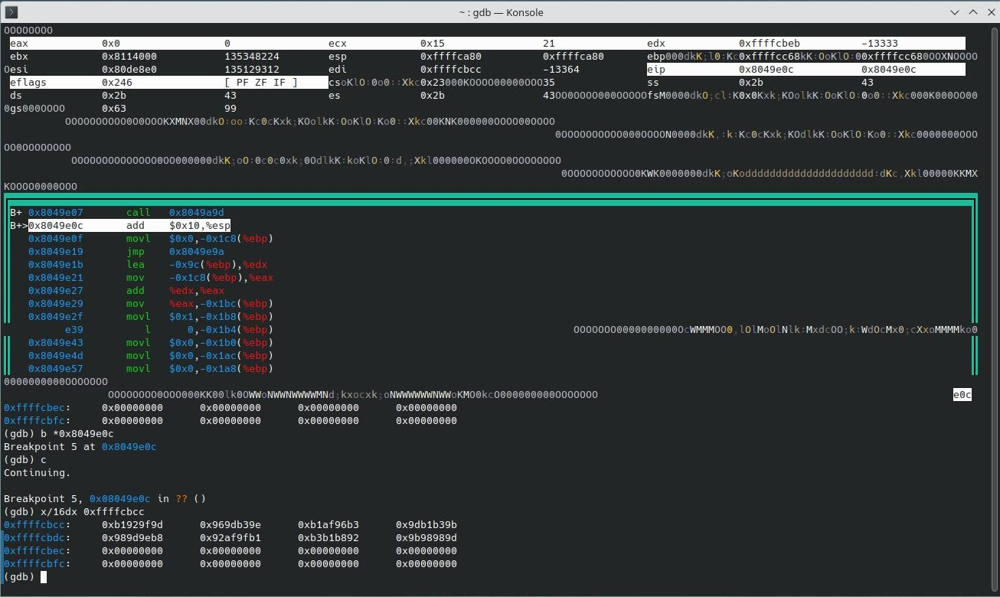

`user_input` has clearly changed again, so let's enter `sub_8049A9D` to see:

```c
unsigned int __cdecl sub_8049A9D(unsigned int a1)
{
  unsigned int v1; // ecx
  unsigned int result; // eax
  char v3; // [esp+1Bh] [ebp-3Dh]
  unsigned int i; // [esp+1Ch] [ebp-3Ch]
  unsigned int v5; // [esp+44h] [ebp-14h]
  unsigned int v6; // [esp+4Ch] [ebp-Ch]
  void *retaddr[2]; // [esp+5Ch] [ebp+4h]

  v6 = __readgsdword(0x14u);
  for ( i = 0; i < a1; ++i )
  {
    sub_8049A05();
    v3 = *((_BYTE *)retaddr[1] + v5 % a1);
    v1 = v5 % a1;
    *((_BYTE *)retaddr[1] + v5 % a1) = *((_BYTE *)retaddr[1] + i);
    *((_BYTE *)retaddr[1] + i) = v3;
  }
  result = v6 - __readgsdword(0x14u);
  if ( result )
    sub_8079620(v1);
  return result;
}
```

Through dynamic debugging, we can notice that `a1` is always the constant `32`, and `retaddr[1]` holds the address of `user_input`. The variable `v5` holds the result returned by `sub_8049A05` in each iteration.

Therefore, let's re-simplify this function, remove canary-related functions, and rename variables:

```c
void sub_8049A9D(unsigned int a1)
{
  unsigned int i; // [esp+1Ch] [ebp-3Ch]
  unsigned int v5; // [esp+44h] [ebp-14h]

  for ( i = 0; i < 32; ++i )
  {
    sub_8049A05();
    int mod = v5 % 32;
    char tmp = user_input[v5 % 32];
    user_input[v5 % 32] = user_input[i];
    user_input[i] = tmp;
  }
}
```

This is clearly a reversible position swapping function. So we just need to get the values of `v5` to understand the process. And through memory breakpoints, it can be determined that the value of `v5` comes from within `sub_8049A05`.

This function also cannot be converted to pseudocode. Let's analyze it:

```assembly
sub_8049A05 proc far
call    sub_8049F67

add     eax, (offset jpt_8055B72 - $)
xor     eax, eax
inc     eax
jnz     short loc_8049A49

mov     [ebx+1Ch], esp
dec     eax
sub     esp, 10h
dec     eax
mov     eax, 0Fh
dec     eax
not     eax
dec     eax
and     esp, eax
mov     edi, [ebx]
mov     esi, [ebx+4]
mov     edx, [ebx+8]
mov     ecx, [ebx+0Ch]
inc     esp
mov     eax, [ebx+10h]
inc     esp
mov     ecx, [ebx+14h]
push    ebx
call    sub_804A071

pop     ebx
mov     [ebx+18h], eax
mov     esp, [ebx+1Ch]
retf

loc_8049A49:
call    sub_80497CF

retn

sub_8049A05 endp
```

Similar structure to the function called in the first loop, we repeat the verification process and get the same conclusion, which won't be elaborated further.

Therefore, let's analyze the actual called function `sub_804A071`:

```c
int sub_804A071()
{
  int i; // [esp+0h] [ebp-1Ch]
  int v2; // [esp+4h] [ebp-18h]
  unsigned int v3; // [esp+Ch] [ebp-10h]

  v2 = 0;
  LOBYTE(v3) = 0;
  for ( i = 0; i <= MEMORY[0xCB230]; ++i )
  {
    MEMORY[0xCB26D] = MEMORY[0xCB284] - 2;
    v3 = (((MEMORY[0xCB284] - 1) ^ (((unsigned int)(MEMORY[0xCB284] - 2) >> 26) - 1)) - 1) ^ (((((((MEMORY[0xCB287] - 2) << 23)- 1) ^ (unsigned int)(MEMORY[0xCB287] - 1))- 1) >> 17)- 1) ^ (((MEMORY[0xCB287] - 2) << 23)- 1) ^ (MEMORY[0xCB287] - 1);
    MEMORY[0xCB242] = v3 - 1;
    v2 = v3 + MEMORY[0xCB284] - 2 - 1;
  }
  MEMORY[0xCB21E] = v3;
  return v2;
}
```

**Invalid Memory References!** From the assembly, we can see that these memory references are likely relative to the `ds` segment, e.g., `ds:0CB21Eh`. But the base address of the `ds` segment is usually 0 (in flat memory model). We cannot determine the actual addresses these references point to, and consequently, we cannot know `v5` by simulating this function.

I spent a lot of time here. However, although we cannot trace the calculation process, why don't we just get its result directly?

Therefore, we can set a breakpoint at `int mod_idx = v5 % 32;` and analyze `v5`. `v5` has a different value in each loop iteration, but these values are fixed and do not change based on the input. So we only need to obtain all 32 values. 

> Notice: Because I thought manual recording might be faster than writing a script at the time, I didn't write a GDB script to automate the recording.

> 2025/03/28 Update(After reading official writeup): This behavior more likely cause using x86 to parse x64, GDB also do this because it assumes that the program is 32-bit at runtime based on ELF32

Finally, we obtained the constants as follows:

```python
[
    0x555a68b4,
    0x9e9faf52,
    0x21372c5b,
    0x58548dc8,
    0x160de418,
    0xaa134944,
    0x06da9db0,
    0x8f8cdca5,
    0xee1d32d5,
    0x53be002a,
    0x41748a70,
    0x580520dc,
    0xf72f843a,
    0xebbdfd0d,
    0xd041ab37,
    0x5a60a1bb,
    0xb6ee3b83,
    0xd770c253,
    0x0a59e2dc,
    0x2c9a033f,
    0xfcc8c3b4,
    0xd5110dba,
    0xd883a760,
    0xae3c63df,
    0x9a0025ff,
    0x53d79c20,
    0x33088438,
    0xc9cc05e2,
    0x38574758,
    0x05581937,
    0x6ea0c95c,
    0x5ed2e955
]
```

Now that `v5` values are known, we can re-implement this logic in a Python script to verify:

```python
consts = [
    0x555a68b4, 0x9e9faf52, 0x21372c5b, 0x58548dc8, 0x160de418, 0xaa134944, 0x06da9db0, 0x8f8cdca5,
    0xee1d32d5, 0x53be002a, 0x41748a70, 0x580520dc, 0xf72f843a, 0xebbdfd0d, 0xd041ab37, 0x5a60a1bb,
    0xb6ee3b83, 0xd770c253, 0x0a59e2dc, 0x2c9a033f, 0xfcc8c3b4, 0xd5110dba, 0xd883a760, 0xae3c63df,
    0x9a0025ff, 0x53d79c20, 0x33088438, 0xc9cc05e2, 0x38574758, 0x05581937, 0x6ea0c95c, 0x5ed2e955
]

# (Previous code)
# ...

def main():
    data = []
    cnt = 32
    inpt_str = "random_stringsrandom_stringsrand"

    for i in range(cnt):
        data.append(ord(inpt_str[i]))

    for i in range(cnt):
        val = data[i]
        result = ((val >> 1) & 0x55) | ((2 * val) & 0xAA)
        data[i] = result

    for i in range(cnt):
        div_magic = consts[i]
        mod_idx = (div_magic % cnt)
        mod_idx_data = data[mod_idx]
        data[mod_idx] = data[i]
        data[i] = mod_idx_data
    print_hex(data)
   
main()
```

Running it gives:

```
> python .\derive.py
['0xb1', '0x92', '0x9f', '0x9d', '0x96', '0x9d', '0xb3', '0x9e', '0xb1', '0xaf', '0x96', '0xb3', '0x9d', '0xb1', '0xb3', '0x9b', '0x98', '0x9d', '0x9e', '0xb8', '0x92', '0xaf', '0x9f', '0xb1', '0xb3', '0xb1', '0xb8', '0x92', '0x9b', '0x98', '0x98', '0x9d']
```

Matches the actual output after `user_input` is transformed.

### Second Loop

> **WARNING: Before you reading this part, please understand: Most of this part should actually be based on x86-64 analysis, while the following content uses x86 analysis and is therefore likely to be wrong!**

Next is the second loop. The pseudocode from IDA is the same incorrectly analyzed code as the first loop's assignment:

```c
  for ( j = 0; j < 32; v8[j++] = 33 )
    sub_804996D(i);
```

Looking at the assembly:

```assembly
mov     edx, [ebp+length]
mov     eax, [ebp+loop_cnt]
mov     [ebp+eax*4+v8_base], edx
add     [ebp+loop_cnt], 1
```

So we fix the pseudocode logic as:

```c
  for ( j = 0; j < 32; ++j )
  {
      sub_804996D(i);
      v8[j] = length;
  }
```

Then enter `sub_804996D`. This function also cannot be converted to pseudocode. Let's look at the assembly:

```assembly
sub_804996D proc far
call    sub_8049F67

add     eax, (offset jpt_8055B72 - $)
xor     eax, eax
inc     eax
jnz     short loc_80499B1

mov     [ebx+1Ch], esp
dec     eax
sub     esp, 10h
dec     eax
mov     eax, 0Fh
dec     eax
not     eax
dec     eax
and     esp, eax
mov     edi, [ebx]
mov     esi, [ebx+4]
mov     edx, [ebx+8]
mov     ecx, [ebx+0Ch]
inc     esp
mov     eax, [ebx+10h]
inc     esp
mov     ecx, [ebx+14h]
push    ebx
call    sub_804A151

pop     ebx
mov     [ebx+18h], eax
mov     esp, [ebx+1Ch]
retf

loc_80499B1:
call    sub_8049862

retn
```

Similar structure to the function called in the first loop, we repeat the verification process and get the same conclusion, no further elaboration.

Therefore, let's further analyze the actual called function `sub_804A151`:

```c
int __usercall sub_804A151@<eax>(int a1@<edi>, unsigned int a2@<esi>)
{
  unsigned int v4; // [esp+18h] [ebp-18h]
  int i; // [esp+20h] [ebp-10h]
  unsigned int j; // [esp+28h] [ebp-8h]
  char v7; // [esp+2Fh] [ebp-1h] BYREF

  v4 = -1;
  for ( i = 0; i - 1 < a2; ++i )
  {
    v4 ^= *(unsigned __int8 *)(a1 + i - 1) - 1;
    for ( j = 0; j <= 7; ++j )
    {
      if ( (v4 & 1) == 1 )
      {
        v4 >>= 1;
      }
      else
      {
        _EDX = ((v4 - 1) >> 1) - 1;
        v7 = HIBYTE(a1);
        __asm { insb }
        v4 = (_EDX ^ (unsigned int)&v7) - 1;
      }
    }
  }
  return ~(v4 - 1);
}
```

Through dynamic debugging, we know that `a1` is the pointer to `user_input[j]`, and `a2` is always `1`.

Further analysis of the loop reveals that it seems to be obfuscated, and on the surface, it appears irreversible. But by observing skipped instructions during dynamic debugging and other characteristics, we can find dead code:

```assembly
endbr64
push    ebp
dec     eax
mov     ebp, esp
dec     eax
mov     [ebp+var_28], edi
dec     eax
mov     [ebp+var_30], esi
dec     eax
mov     [ebp+var_18], 0FFFFFFFFh
dec     eax
mov     [ebp+var_10], 0
jmp     short loc_804A1D0

loc_804A173:
dec     eax
mov     edx, [ebp+var_28]
dec     eax
mov     eax, [ebp+var_10]
dec     eax
add     eax, edx
movzx   eax, byte ptr [eax]
movzx   eax, al
dec     eax
xor     [ebp+var_18], eax
dec     eax
mov     [ebp+var_8], 0
jmp     short loc_804A1C4

loc_804A192:
dec     eax
mov     eax, [ebp+var_18]
and     eax, 1
dec     eax
test    eax, eax
jz      short loc_804A1BB

dec     eax
mov     eax, [ebp+var_18]
dec     eax
shr     eax, 1
dec     eax
mov     edx, eax
dec     eax
mov     eax, 0D7870F42h
xchg    eax, ebp
push    edi
insb
leave
dec     eax
xor     eax, edx
dec     eax
mov     [ebp+var_18], eax
jmp     short loc_804A1BF

loc_804A1BB:
dec     eax
shr     [ebp+var_18], 1


loc_804A1BF:
dec     eax
add     [ebp+var_8], 1


loc_804A1C4:
dec     eax
cmp     [ebp+var_8], 7
jbe     short loc_804A192

dec     eax
add     [ebp+var_10], 1


loc_804A1D0:
dec     eax
mov     eax, [ebp+var_10]
dec     eax
cmp     eax, [ebp+var_30]
jb      short loc_804A173

dec     eax
mov     eax, [ebp+var_18]
dec     eax
not     eax
pop     ebp
retn
```

From the above assembly, we can clearly observe numerous `dec eax` dead code instructions, so we remove them.

Also, the following code is also dead code, so we remove it:

```assembly
xchg    eax, ebp
push    edi
insb
leave
```

Furthermore, since `a2` is always `1`, we can remove the outer loop structure. Thus we can obtain the following pseudocode:

```c
unsigned int __usercall sub_804A151@<eax>(uint8_t* a1@<edi>, unsigned int a2@<esi>)
{
  unsigned int v3; // [esp+18h] [ebp-18h]
  unsigned int i; // [esp+20h] [ebp-10h]
  unsigned int j; // [esp+28h] [ebp-8h]

  v3 = 0xFFFFFFFF;
  v3 ^= *a1;
  for ( i = 0; i <= 7; ++i )
  {
      if ( (v3 & 1) != 0 )
          v3 = (v3 >> 1) ^ 0xD7870F42;
      else
          v3 >>= 1;
  }
  return ~v3;
}
```

From the code, we can see that `sub_804A151` takes the pointer to `user_input[j]` from the outer loop, processes it through an irreversible CRC-like operation to obtain a `uint32_t` value, and then assigns this value to `v8[j]`.

Since this operation is irreversible, we need to implement an equivalent function and restore the state of `user_input` before this transformation.

### The Trap - The Broken Function

> **WARNING: Before you reading this part, please understand: Most of this part should actually be based on x86-64 analysis, while the following content uses x86 analysis and is therefore likely to be wrong!**

Now, it seems we have completely elucidated the logic of the three important transformations, and the flag appears within reach... Is that really the case? Unfortunately, what follows is the most vicious trap.

First, let's look at the values actually obtained by running the program - the expected values we need:

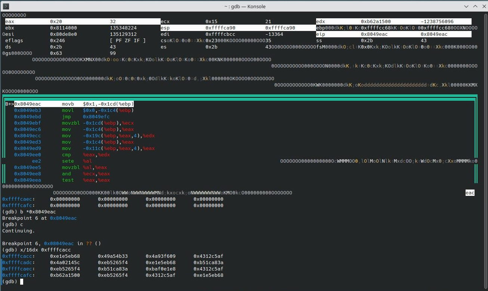

Then, we add the following equivalent implementation (based on the cleaned C code) to the main part of the Python script:

```python
output = []
for i in range(cnt):
    val = 0xFFFFFFFF
    val ^= data[i]
    for _ in range(8):
        if (val & 1) != 0:
            val >>= 1
            val = val ^ 0xD7870F42
        else:
            val >>= 1
    output.append(hex((~val) & 0xFFFFFFFF))
print(output)
```

Running it gives:

```
> python .\derive.py
['0x9ae5eb68', '0x76a54b33', '0x4f93f609', '0xe012c5af', '0xd702145c', '0xc5265f4', '0x9ae5eb68', '0x381ca83a', '0xc5265f4', '0x381ca83a', '0xe5f0e1e8', '0xe012c5af', '0x12a1500', '0xc5265f4', '0xe012c5af', '0x9ae5eb68', '0xaeab26a6', '0xd702145c', '0x9ae5eb68', '0x4ccdea34', '0xe012c5af', '0x76a54b33', '0xe5f0e1e8', '0x4f93f609', '0x4f93f609', '0xaeab26a6', '0xe012c5af', '0xc5265f4', '0x9ae5eb68', '0x4ccdea34', '0x4ccdea34', '0x12a1500']
```

**The results don't match!** Why is this happening? Let's add breakpoints at a finer granularity within the inner loop of and record the `val`:

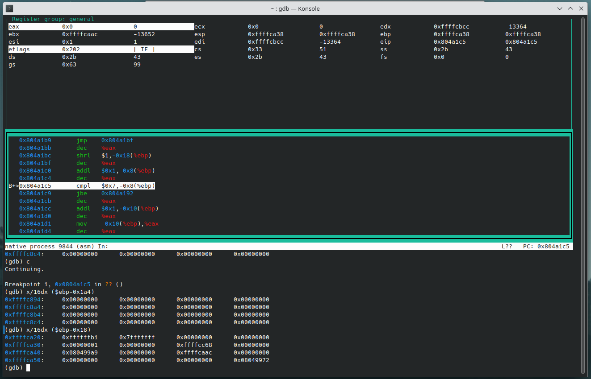

```
0 0x7fffffb0
1 0x3fffffd8
2 0x1fffffec
3 0xffffff6
4 0x7fffffb
5 0xd478f0bf
6 0xbdbb771d
7 0x895ab4cc
```

From this, we can see that the most significant bit doesn't match.

So I started suspecting if it was an issue with the Python implementation (e.g., signed vs unsigned shifts). Therefore, I implemented unsigned logical shifts in JavaScript and C/C++ and compiled using the same version of `gcc-11`/`g++-11`.

Here are details of the C++ implementation:

```cpp
for (int i = 0; i < cnt; ++i)
{
    uint32_t val = 0xFFFFFFFFu;
    val ^= data[i];
    for (int j = 0; j <= 7; ++j)
    {
        if ((val & 1u) != 0)
            val = (val >> 1) ^ 0xD7870F42u;
        else
            val = val >> 1;
    }
    user_input_arr.push_back(~val);
}
```

The output from the C++ implementation was:

```
9ae5eb68
76a54b33
4f93f609
e012c5af
d702145c
c5265f4
9ae5eb68
381ca83a
c5265f4
381ca83a
e5f0e1e8
e012c5af
12a1500
c5265f4
e012c5af
73476f74
aeab26a6
d702145c
9ae5eb68
3564d8ce
a56f6e28
76a54b33
e5f0e1e8
4f93f609
df9840ef
aeab26a6
e012c5af
c5265f4
9ae5eb68
4ccdea34
7bdd3bc7
12a1500
```

Same as Python implementation, the C++ implementation is close to the expected output, but still slightly deviates.

So, I started single-stepping through the instructions near the shift, trying to find where the problem was:

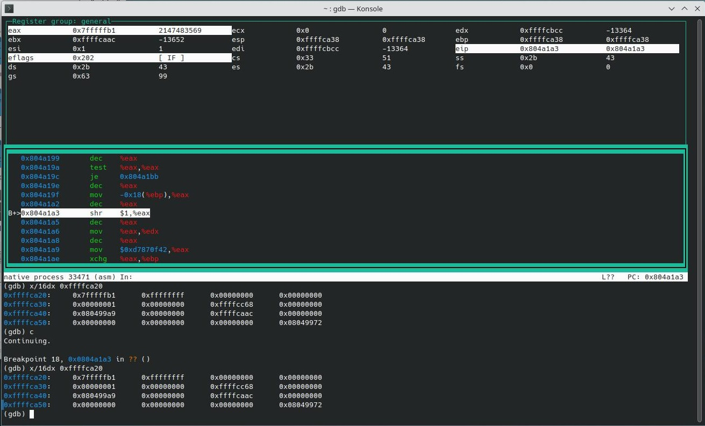

However, something unexpected happened: **After single-stepping past the dead code, the output actually matched the output of the C++ implementation. This indicates that the dead code actually affects the function's behavior in the original execution!** 

> 2025/03/28 Update(After reading official writeup): This behavior more likely cause using x86 to parse x64, GDB also do this because it assumes that the program is 32-bit at runtime based on ELF32
>
> So let's think *actually* why it will be this behavior, when GDB single-steps, it actually inserts a temporary int3 under each instruction.
>
> But if GDB incorrectly interprets an x86-64 instruction as x86, it will insert int3 at the **wrong place**, thus corrupting the instruction.
>
> In this example, the int3 inserted by GDB actually turns the x86-64 instruction into **two x86 instructions**, which is consistent with the CRC64 function we implemented incorrectly based on the 32-bit premise, so the same result will appear when single-stepping.

After spending a lot of time stuck and thinking, I finally realized: **this is actually not anti-debugging, but most likely the dead code causing unpredictable deviations in the function's behavior, and no standard equivalent implementation can reproduce this effect.** When I reached this conclusion, it was already 18:20 (GMT+9) on the deadline afternoon, less than 3 hours and 40 minutes before the deadline.

This is undoubtedly a trap meticulously designed by the challenge author to waste the challenger's time, and an insidious trap set right at the final "last mile" moment. Obviously, it was particularly effective against someone like me who was short on time.

### Escaping the Trap - Bypassing the Maginot Line

> **WARNING: Before you reading this part, please understand: This part is likely based on incorrect assumptions!**

*Could this be an unsolvable problem? No, that's impossible. Since there are people who submitted successfully, there must be a solution.*

So I reorganized my thoughts:
First, why do we need to implement this function ourselves?
Answer: Because we need to iterate through all values in the `char` range within the script and find the input byte that produces each corresponding value in `check_arr`.
So why can't we pre-compute the output of the *original* function for every possible input byte, and then use this mapping to find the input byte corresponding to each value in `check_arr`?

Therefore, since we rely on the ambiguous behavior of the original implementation, we must implement hooking behavior on the original program. Specifically, we need to do the following:

1.  Set a breakpoint at the entry of the function and modify the byte pointed to by pointer parameter to the current value in our iteration.
2.  Set a breakpoint just before the return instruction. When hit, get the return value (`eax`).
4.  Record the input byte and the corresponding output value, store locally.

To implement these functions, I decided to use a GDB script:

```gdb
# GDB Script: Modify memory via EDI pointer, get eax value before return, restart each time

python
# --- Configuration ---
EXECUTABLE_PATH = "./challenge" # Executable path
FUNCTION_ADDRESS = 0x804a155
CHECK_ADDRESS = 0x804a1e1
POINTER_REGISTER = "$edi"
RESULT_REGISTER = "$eax"
OUTPUT_FILE = "out.txt"
MODIFY_RANGE = range(256)   # Iteration range
# --- Configuration End ---
end

# Set GDB output pagination off
set pagination off
set disassembly-flavor intel

# Enter Python environment to execute main logic
python
import gdb
import os
import datetime
import struct
import time

# --- Get variables from GDB configuration ---
exe_path = gdb.execute("python print(EXECUTABLE_PATH)", to_string=True).strip().strip('"')
func_addr_str = gdb.execute("python print(hex(FUNCTION_ADDRESS))", to_string=True).strip()
check_addr_str = gdb.execute("python print(hex(CHECK_ADDRESS))", to_string=True).strip()
pointer_reg = gdb.execute("python print(POINTER_REGISTER)", to_string=True).strip().strip('"')
result_reg = gdb.execute("python print(RESULT_REGISTER)", to_string=True).strip().strip('"')
output_file = gdb.execute("python print(OUTPUT_FILE)", to_string=True).strip().strip('"')
modify_range = MODIFY_RANGE

# Convert address strings to integers
func_addr = int(func_addr_str, 16)
check_addr = int(check_addr_str, 16)

print(f"--- Starting automated memory modification and register reading ---")
print(f"Program: {exe_path}")
print(f"Function Entry Breakpoint: {func_addr_str}")
print(f"Check Address Breakpoint: {check_addr_str}")
print(f"Pointer Register: {pointer_reg}")
print(f"Register to Read at Check Address: {result_reg}")
print(f"Output File: {output_file}")
print(f"Modification Value Range: 0-{len(modify_range)-1}")
print(f"-----------------------------------")

results = {} # Stores {modified_value: read_register_value or error_message}

# Check executable file
if not os.path.exists(exe_path):
    print(f"Error: Cannot find executable file '{exe_path}'")
    gdb.quit(1)

# Load program file information once
try:
    gdb.execute(f"file {exe_path}")
except gdb.error as e:
    print(f"Error: Failed to load file '{exe_path}': {e}")
    gdb.quit(1)

# --- Main Loop ---
for i in modify_range:
    print(f"\n--- Testing modification value: {i} (0x{i:x}) ---")
    current_result = f"Error: Unknown failure for input {i}"
    addr_pointed_by_reg = -1
    try:
        # 1. Clear old breakpoints and set new ones
        gdb.execute("delete breakpoints")
        gdb.execute(f"break *{func_addr_str}", to_string=True)
        gdb.execute(f"break *{check_addr_str}", to_string=True)
        print(f"  Set breakpoints at {func_addr_str} and {check_addr_str}")

        # 2. Run the program with input redirection
        print(f"  Running program (run < input.txt)...")
        run_output = gdb.execute("run < input.txt", to_string=True)

        # Check if program hit the first breakpoint
        try:
            if not gdb.selected_inferior() or not gdb.selected_inferior().is_valid() or gdb.selected_inferior().pid <= 0:
                 print(f"  Warning: Program seems to have exited or crashed before reaching function entry ({func_addr_str}).")
                 print(f"  'run' output: {run_output.strip()}")
                 current_result = "Error: Program exited/crashed before reaching function entry"
                 results[i] = current_result
                 continue
        except gdb.error:
             print(f"  Warning: Cannot get current process info, program may have crashed.")
             print(f"  'run' output: {run_output.strip()}")
             current_result = "Error: Program likely crashed before function entry"
             results[i] = current_result
             continue
             
        # Program should stop at FUNCTION_ADDRESS
        current_pc = int(gdb.parse_and_eval("$pc"))
        if current_pc == func_addr:
            print(f"  Stopped at function entry {func_addr_str}")

            try:
                # 3. Read the value of the pointer register
                reg_value_obj = gdb.parse_and_eval(pointer_reg)
                addr_pointed_by_reg = int(reg_value_obj)
                print(f"  Read value of {pointer_reg}: 0x{addr_pointed_by_reg:x}")

                # 4. Prepare the byte to write
                byte_to_write = i.to_bytes(1, 'little')
                print(f"  Preparing to write byte 0x{i:x} to address 0x{addr_pointed_by_reg:x}")

                # 5. Write to memory
                inferior = gdb.selected_inferior()
                inferior.write_memory(addr_pointed_by_reg, byte_to_write)
                print(f"  Successfully wrote 1 byte to 0x{addr_pointed_by_reg:x}")

                # 6. Continue execution to the check address
                print(f"  Continuing execution (continue)...")
                continue_output = gdb.execute("continue", to_string=True)

                # Check if program hit the second breakpoint
                try:
                    if not gdb.selected_inferior() or not gdb.selected_inferior().is_valid() or gdb.selected_inferior().pid <= 0:
                        print(f"  Warning: Program seems to have exited or crashed before reaching check address ({check_addr_str}). (Modified 0x{addr_pointed_by_reg:x}?)")
                        print(f"  'continue' output: {continue_output.strip()}")
                        current_result = f"Error: Program exited/crashed before check address (modified 0x{addr_pointed_by_reg:x}?)"
                        results[i] = current_result
                        continue
                except gdb.error:
                    print(f"  Warning: Cannot get current process info, program may have crashed during continue.")
                    print(f"  'continue' output: {continue_output.strip()}")
                    current_result = f"Error: Program likely crashed during continue (modified 0x{addr_pointed_by_reg:x}?)"
                    results[i] = current_result
                    continue

                # Program should stop at CHECK_ADDRESS
                current_pc_after_continue = int(gdb.parse_and_eval("$pc"))
                if current_pc_after_continue == check_addr:
                    print(f"  Stopped at check address {check_addr_str}")

                    # 7. Read the value of the result register (RESULT_REGISTER)
                    try:
                        result_reg_obj = gdb.parse_and_eval(result_reg)
                        # Try converting to Python int
                        result_value = int(result_reg_obj)
                        # Format hex output based on register type (assume $eax is 32-bit)
                        hex_value_str = f"0x{(result_value & 0xFFFFFFFF):x}" # Always mask to 32 bits for $eax
                        print(f"  Read register {result_reg} value: {result_value} ({hex_value_str})")
                        current_result = result_value # Record successfully read value (as int)

                    except (gdb.error, TypeError, ValueError) as e:
                        # Error reading or converting register value
                        print(f"  Error: Cannot read or parse register {result_reg}: {e}")
                        current_result = f"Error: Cannot parse {result_reg} ({e})"

                else:
                    print(f"  Warning: Stopped at unexpected address 0x{current_pc_after_continue:x} after continue (Expected {check_addr_str}).")
                    current_result = f"Error: Stopped at unexpected address 0x{current_pc_after_continue:x}"

            except gdb.MemoryError:
                 print(f"  Error: Cannot write memory to address 0x{addr_pointed_by_reg:x} (value of {pointer_reg}).")
                 current_result = f"Error: Cannot write to address 0x{addr_pointed_by_reg:x} from {pointer_reg}"
            except (TypeError, ValueError) as e:
                 print(f"  Error: Cannot parse value of register {pointer_reg} as a valid address: {reg_value_obj}. {e}")
                 current_result = f"Error: Cannot parse address from {pointer_reg}: {reg_value_obj}"
            except gdb.error as e:
                 print(f"  Error: GDB error occurred during operation at function entry: {e}")
                 current_result = f"Error: GDB error at function entry: {e}"

        else:
            print(f"  Warning: Stopped at unexpected address 0x{current_pc:x} after Run (Expected {func_addr_str}).")
            current_result = f"Error: Did not stop at function entry 0x{current_pc:x}"

        results[i] = current_result

    except gdb.error as e:
        print(f"  GDB execution error (outer): {e}")
        results[i] = f"Error: Outer GDB error - {e}"
    except Exception as e:
        import traceback
        print(f"  Python script error (outer): {e}")
        traceback.print_exc()
        results[i] = f"Error: Outer Python script error - {e}"

# --- After Loop Ends ---

# Write results to file
print(f"\n--- Testing Complete ---")
print(f"Writing results to file: {output_file}")
try:
    with open(output_file, "w", encoding='utf-8') as f:
        f.write(f"# GDB Automated Memory Modification and Register Reading Results\n")
        f.write(f"# Program: {exe_path}\n")
        f.write(f"# Function Entry: {func_addr_str}\n")
        f.write(f"# Check Address: {check_addr_str}\n")
        f.write(f"# Pointer Register: {pointer_reg}\n")
        f.write(f"# Modified Address: [Value of {pointer_reg} at entry]\n")
        f.write(f"# Read Register: {result_reg} (at Check Address)\n")
        f.write(f"# Test Time: {datetime.datetime.now().strftime('%Y-%m-%d %H:%M:%S')}\n")
        f.write("# ---\n")
        f.write(f"# Modified Value (Dec), Modified Value (Hex), {result_reg} Value (Dec), {result_reg} Value (Hex), Remarks\n")

        for i in modify_range:
            result = results.get(i, "Not Tested")
            result_dec_str = ""
            result_hex_str = ""
            remark = ""
            if isinstance(result, int):
                 result_dec_str = str(result)
                 # Ensure hex format is 32-bit for $eax
                 mask = 0xFFFFFFFF
                 result_hex_str = f"0x{(result & mask):x}"
            elif isinstance(result, gdb.Value): # If int conversion failed, might still be gdb.Value
                remark = f"Error: Result is GDB Value, not int ({result})"
            else: # Error message string
                remark = str(result)

            f.write(f"{i}, 0x{i:x}, {result_dec_str}, {result_hex_str}, {remark}\n")

    print(f"Results successfully written to {output_file}")
except IOError as e:
    print(f"Error: Cannot write to file {output_file}: {e}")
    gdb.quit(2)

# Normal exit
gdb.quit(0)

end
# --- Python Script End ---
# quit
```

Then execute:

```sh
gdb --batch -x map.gdb
```

Finally, the following result can be obtained:

```
# GDB Automated Memory Modification and Register Reading Results
# Program: ./challenge
# Function Entry: 0x804a155
# Check Address: 0x804a1e1
# Pointer Register: $edi
# Modified Address: [Value of $edi at entry]
# Read Register: $eax (at Check Address)
# Test Time: 2025-03-26 18:52:16
# ---
# Modified Value (Dec), Modified Value (Hex), $eax Value (Dec), $eax Value (Hex), Remarks
0, 0x0, 1684488025, 0x64673f59, 
1, 0x1, 1740660790, 0x67c06036, 
2, 0x2, 3425148674, 0xcc279f02, 
3, 0x3, 3481321581, 0xcf80c06d, 
4, 0x4, 2615697770, 0x9be8616a, 
5, 0x5, 2555330053, 0x984f3e05, 
6, 0x6, 866697521, 0x33a8c131, 
7, 0x7, 806329950, 0x300f9e5e, 
8, 0x8, 2608431935, 0x9b79833f, 
9, 0x9, 2564742224, 0x98dedc50, 
10, 0xa, 859382628, 0x33392364, 
11, 0xb, 815692811, 0x309e7c0b, 
12, 0xc, 1693900044, 0x64f6dd0c, 
13, 0xd, 1733395043, 0x67518263, 
14, 0xe, 3434511703, 0xccb67d57, 
15, 0xf, 3474006584, 0xcf112238, 
16, 0x10, 894720272, 0x35545910, 
17, 0x11, 921896575, 0x36f3067f, 
18, 0x12, 2635397451, 0x9d14f94b, 
19, 0x13, 2662573604, 0x9eb3a624, 
20, 0x14, 3403351843, 0xcadb0723, 
21, 0x15, 3380369484, 0xc97c584c, 
22, 0x16, 1654368120, 0x629ba778, 
23, 0x17, 1631385623, 0x613cf817, 
24, 0x18, 3393906038, 0xca4ae576, 
25, 0x19, 3387800089, 0xc9edba19, 
26, 0x1a, 1644840237, 0x620a452d, 
27, 0x1b, 1638734402, 0x61ad1a42, 
28, 0x1c, 902150981, 0x35c5bb45, 
29, 0x1d, 912450602, 0x3662e42a, 
30, 0x1e, 2642746142, 0x9d851b1e, 
31, 0x1f, 2653045873, 0x9e224471, 
32, 0x20, 3322016715, 0xc601f3cb, 
33, 0x21, 3316034724, 0xc5a6aca4, 
34, 0x22, 1849774992, 0x6e415390, 
35, 0x23, 1843793151, 0x6de60cff, 
36, 0x24, 965651960, 0x398eadf8, 
37, 0x25, 975827607, 0x3a29f297, 
38, 0x26, 2446200227, 0x91ce0da3, 
39, 0x27, 2456376012, 0x926952cc, 
40, 0x28, 958353325, 0x391f4fad, 
41, 0x29, 985141442, 0x3ab810c2, 
42, 0x2a, 2438983670, 0x915feff6, 
43, 0x2b, 2465771673, 0x92f8b099, 
44, 0x2c, 3331330462, 0xc690119e, 
45, 0x2d, 3308736241, 0xc5374ef1, 
46, 0x2e, 1859170757, 0x6ed0b1c5, 
47, 0x2f, 1836576426, 0x6d77eeaa, 
48, 0x30, 2536674690, 0x97329582, 
49, 0x31, 2492844781, 0x9495caed, 
50, 0x32, 1064449497, 0x3f7235d9, 
51, 0x33, 1020619446, 0x3cd56ab6, 
52, 0x34, 1757268913, 0x68bdcbb1, 
53, 0x35, 1796904158, 0x6b1a94de, 
54, 0x36, 3237833706, 0xc0fd6bea, 
55, 0x37, 3277468805, 0xc35a3485, 
56, 0x38, 1747724772, 0x682c29e4, 
57, 0x39, 1804301963, 0x6b8b768b, 
58, 0x3a, 3228338623, 0xc06c89bf, 
59, 0x3b, 3284915920, 0xc3cbd6d0, 
60, 0x3c, 2544072663, 0x97a377d7, 
61, 0x3d, 2483300536, 0x940428b8, 
62, 0x3e, 1071896460, 0x3fe3d78c, 
63, 0x3f, 1011124451, 0x3c4488e3, 
64, 0x40, 2409937144, 0x8fa4b8f8, 
65, 0x41, 2349066135, 0x8c03e797, 
66, 0x42, 669259939, 0x27e418a3, 
67, 0x43, 608389068, 0x244347cc, 
68, 0x44, 1881925323, 0x702be6cb, 
69, 0x45, 1938602404, 0x738cb9a4, 
70, 0x46, 3630909072, 0xd86b4690, 
71, 0x47, 3687586303, 0xdbcc19ff, 
72, 0x48, 1891239070, 0x70ba049e, 
73, 0x49, 1931303921, 0x731d5bf1, 
74, 0x4a, 3640304837, 0xd8faa4c5, 
75, 0x4b, 3680369578, 0xdb5dfbaa, 
76, 0x4c, 2402638509, 0x8f355aad, 
77, 0x4d, 2358379970, 0x8c9205c2, 
78, 0x4e, 662043382, 0x2775faf6, 
79, 0x4f, 617784729, 0x24d2a599, 
80, 0x50, 3734494897, 0xde97deb1, 
81, 0x51, 3710943710, 0xdd3081de, 
82, 0x52, 1993834218, 0x76d77eea, 
83, 0x53, 1970282885, 0x75702185, 
84, 0x54, 555253890, 0x21188082, 
85, 0x55, 583000045, 0x22bfdfed, 
86, 0x56, 2304254169, 0x895820d9, 
87, 0x57, 2332000182, 0x8aff7fb6, 
88, 0x58, 562651863, 0x218962d7, 
89, 0x59, 573455800, 0x222e3db8, 
90, 0x5a, 2311701132, 0x89c9c28c, 
91, 0x5b, 2322505187, 0x8a6e9de3, 
92, 0x5c, 3724950756, 0xde063ce4, 
93, 0x5d, 3718341515, 0xdda1638b, 
94, 0x5e, 1984339135, 0x76469cbf, 
95, 0x5f, 1977730000, 0x75e1c3d0, 
96, 0x60, 767718506, 0x2dc2746a, 
97, 0x61, 778382085, 0x2e652b05, 
98, 0x62, 2239943729, 0x8582d431, 
99, 0x63, 2250607454, 0x86258b5e, 
100, 0x64, 3528272473, 0xd24d2a59, 
101, 0x65, 3521803574, 0xd1ea7536, 
102, 0x66, 2047707650, 0x7a0d8a02, 
103, 0x67, 2041238893, 0x79aad56d, 
104, 0x68, 3537684492, 0xd2dcc80c, 
105, 0x69, 3514537827, 0xd17b9763, 
106, 0x6a, 2057070679, 0x7a9c6857, 
107, 0x6b, 2033923896, 0x793b3738, 
108, 0x6c, 760452671, 0x2d53963f, 
109, 0x6d, 787794256, 0x2ef4c950, 
110, 0x6e, 2232628836, 0x85133664, 
111, 0x6f, 2259970315, 0x86b4690b, 
112, 0x70, 2096173603, 0x7cf11223, 
113, 0x71, 2136362316, 0x7f564d4c, 
114, 0x72, 3568415352, 0xd4b1b278, 
115, 0x73, 3608603927, 0xd716ed17, 
116, 0x74, 2206092304, 0x837e4c10, 
117, 0x75, 2161709951, 0x80d9137f, 
118, 0x76, 725544011, 0x2b3eec4b, 
119, 0x77, 681161508, 0x2899b324, 
120, 0x78, 2213523013, 0x83efae45, 
121, 0x79, 2152263978, 0x8048f12a, 
122, 0x7a, 732892702, 0x2baf0e1e, 
123, 0x7b, 671633777, 0x28085171, 
124, 0x7c, 2086727798, 0x7c60f076, 
125, 0x7d, 2143792921, 0x7fc7af19, 
126, 0x7e, 3558887469, 0xd420502d, 
127, 0x7f, 3615952706, 0xd7870f42, 
128, 0x80, 3017814043, 0xb3e0301b, 
129, 0x81, 2957471604, 0xb0476f74, 
130, 0x82, 463507520, 0x1ba09040, 
131, 0x83, 403164975, 0x1807cf2f, 
132, 0x84, 1282371112, 0x4c6f6e28, 
133, 0x85, 1338519879, 0x4fc83147, 
134, 0x86, 3828338291, 0xe42fce73, 
135, 0x87, 3884486940, 0xe788911c, 
136, 0x88, 1291750525, 0x4cfe8c7d, 
137, 0x89, 1331286802, 0x4f59d312, 
138, 0x8a, 3837668390, 0xe4be2c26, 
139, 0x8b, 3877204809, 0xe7197349, 
140, 0x8c, 3010581070, 0xb371d24e, 
141, 0x8d, 2966850849, 0xb0d68d21, 
142, 0x8e, 456225301, 0x1b317215, 
143, 0x8f, 412495226, 0x18962d7a, 
144, 0x90, 3805501010, 0xe2d35652, 
145, 0x91, 3782478141, 0xe174093d, 
146, 0x92, 1251210761, 0x4a93f609, 
147, 0x93, 1228188006, 0x4934a966, 
148, 0x94, 492570721, 0x1d5c0861, 
149, 0x95, 519788302, 0x1efb570e, 
150, 0x96, 3038554170, 0xb51ca83a, 
151, 0x97, 3065771861, 0xb6bbf755, 
152, 0x98, 500034100, 0x1dcdea34, 
153, 0x99, 510309723, 0x1e6ab55b, 
154, 0x9a, 3045935727, 0xb58d4a6f, 
155, 0x9b, 3056211200, 0xb62a1500, 
156, 0x9c, 3796022279, 0xe242b407, 
157, 0x9d, 3789941608, 0xe1e5eb68, 
158, 0x9e, 1241650268, 0x4a02145c, 
159, 0x9f, 1235569459, 0x49a54b33, 
160, 0xa0, 294059145, 0x1186fc89, 
161, 0xa1, 304194534, 0x1221a3e6, 
162, 0xa2, 3116784850, 0xb9c65cd2, 
163, 0xa3, 3126920125, 0xba6103bd, 
164, 0xa4, 3993608890, 0xee09a2ba, 
165, 0xa5, 3987668437, 0xedaefdd5, 
166, 0xa6, 1179189985, 0x464902e1, 
167, 0xa7, 1173249422, 0x45ee5d8e, 
168, 0xa8, 4002955503, 0xee9840ef, 
169, 0xa9, 3980337024, 0xed3f1f80, 
170, 0xaa, 1188618420, 0x46d8e0b4, 
171, 0xab, 1166000091, 0x457fbfdb, 
172, 0xac, 286727900, 0x11171edc, 
173, 0xad, 313541043, 0x12b041b3, 
174, 0xae, 3109535367, 0xb957be87, 
175, 0xaf, 3136348648, 0xbaf0e1e8, 
176, 0xb0, 1085643456, 0x40b59ac0, 
177, 0xb1, 1125303727, 0x4312c5af, 
178, 0xb2, 3908385435, 0xe8f53a9b, 
179, 0xb3, 3948045812, 0xeb5265f4, 
180, 0xb4, 3208299763, 0xbf3ac4f3, 
181, 0xb5, 3164445596, 0xbc9d9b9c, 
182, 0xb6, 393897128, 0x177a64a8, 
183, 0xb7, 350043079, 0x14dd3bc7, 
184, 0xb8, 3215664806, 0xbfab26a6, 
185, 0xb9, 3154934217, 0xbc0c79c9, 
186, 0xba, 401311485, 0x17eb86fd, 
187, 0xbb, 340580754, 0x144cd992, 
188, 0xbc, 1076131989, 0x40247895, 
189, 0xbd, 1132668922, 0x438327fa, 
190, 0xbe, 3898923214, 0xe864d8ce, 
191, 0xbf, 3955460001, 0xebc387a1, 
192, 0xc0, 1478735802, 0x5823b7ba, 
193, 0xc1, 1535437013, 0x5b84e8d5, 
194, 0xc2, 4033026017, 0xf06317e1, 
195, 0xc3, 4089727118, 0xf3c4488e, 
196, 0xc4, 2813127049, 0xa7ace989, 
197, 0xc5, 2752231142, 0xa40bb6e6, 
198, 0xc6, 267143634, 0xfec49d2, 
199, 0xc7, 206247613, 0xc4b16bd, 
200, 0xc8, 2805795804, 0xa73d0bdc, 
201, 0xc9, 2761577651, 0xa49a54b3, 
202, 0xca, 259894151, 0xf7dab87, 
203, 0xcb, 215676136, 0xcdaf4e8, 
204, 0xcc, 1488082415, 0x58b255ef, 
205, 0xcd, 1528105600, 0x5b150a80, 
206, 0xce, 4042454452, 0xf0f2f5b4, 
207, 0xcf, 4082477787, 0xf355aadb, 
208, 0xd0, 152097267, 0x910d1f3, 
209, 0xd1, 179801756, 0xab78e9c, 
210, 0xd2, 2706403752, 0xa15071a8, 
211, 0xd3, 2734108359, 0xa2f72ec7, 
212, 0xd4, 4137652160, 0xf69f8fc0, 
213, 0xd5, 4114141359, 0xf538d0af, 
214, 0xd6, 1591685019, 0x5edf2f9b, 
215, 0xd7, 1568174324, 0x5d7870f4, 
216, 0xd8, 4128140693, 0xf60e6d95, 
217, 0xd9, 4121506554, 0xf5a932fa, 
218, 0xda, 1582222798, 0x5e4ecdce, 
219, 0xdb, 1575588513, 0x5de992a1, 
220, 0xdc, 159462310, 0x98133a6, 
221, 0xdd, 170290377, 0xa266cc9, 
222, 0xde, 2713818109, 0xa1c193fd, 
223, 0xdf, 2724646034, 0xa266cc92, 
224, 0xe0, 4198857512, 0xfa457b28, 
225, 0xe1, 4192347207, 0xf9e22447, 
226, 0xe2, 1376115571, 0x5205db73, 
227, 0xe3, 1369605148, 0x51a2841c, 
228, 0xe4, 97133851, 0x5ca251b, 
229, 0xe5, 107838068, 0x66d7a74, 
230, 0xe6, 2911536448, 0xad8a8540, 
231, 0xe7, 2922240559, 0xae2dda2f, 
232, 0xe8, 89900878, 0x55bc74e, 
233, 0xe9, 117217313, 0x6fc9821, 
234, 0xea, 2904254229, 0xad1b6715, 
235, 0xeb, 2931570810, 0xaebc387a, 
236, 0xec, 4208236925, 0xfad4997d, 
237, 0xed, 4185114130, 0xf973c612, 
238, 0xee, 1385445670, 0x52943926, 
239, 0xef, 1362323017, 0x51336649, 
240, 0xf0, 2876644705, 0xab761d61, 
241, 0xf1, 2832286222, 0xa8d1420e, 
242, 0xf2, 53919034, 0x336bd3a, 
243, 0xf3, 9560661, 0x91e255, 
244, 0xf4, 1425621842, 0x54f94352, 
245, 0xf5, 1465785405, 0x575e1c3d, 
246, 0xf6, 4240040713, 0xfcb9e309, 
247, 0xf7, 4280204390, 0xff1ebc66, 
248, 0xf8, 1416143111, 0x5468a107, 
249, 0xf9, 1473248872, 0x57cffe68, 
250, 0xfa, 4230480220, 0xfc28015c, 
251, 0xfb, 4287585843, 0xff8f5e33, 
252, 0xfc, 2884108084, 0xabe7ff34, 
253, 0xfd, 2822807643, 0xa840a05b, 
254, 0xfe, 61300591, 0x3a75f6f, 
255, 0xff, 0, 0x0, 

```

Then, after removing all comments, parse the result into `json`:

```python
import json

def main():
    data = {}
    lines = []
    with open('./mapping.txt', 'r', encoding='utf-8') as f:
        while True:
            line = f.readline()
            if line == '':
                break
            lines.append(line.split(', '))
    for line in lines:
        if len(line) >= 4:
            data[int(line[0])] = int(line[2])
    with open('./mapping.json', 'w', encoding='utf-8') as f:
        json.dump(data, f, ensure_ascii=False, indent=4)
main()
```

With this, we have obtained the complete input-output mapping table and can start decrypting.

## Reverse Part.4 Capture The Flag

Through the above steps, we have fully understood the flag validation process. It's time to write the decryption script using reverse operations.

First, let's summarize the validation process of the original program:

1.  Swap adjacent bits of each `char` in the user input, then put it back.
2.  Swap elements of the resulting user input array according to a certain rule.
3.  Process each byte of the array from step 2 through the CRC-like algorithm to get a `uint32_t` array.
4.  Compare this array with the `check_arr` array.

So, we just need to perform the inverse operations one by one in reverse order to derive the flag.

But before that, we still need to get the values of the `check_arr` array.

```c
qmemcpy(check_arr, &unk_80DE860, sizeof(check_arr));
```

From the statement above, we know that `check_arr` is actually a copy of `unk_80DE860`. Therefore, we can directly find `unk_80DE860` and extract its values:

```python
check_arr = [
    0x0B62A1500,
    0x1D5C0861,
    0x4C6F6E28,
    0x4312C5AF,
    0x3CD56AB6,
    0x1E6AB55B,
    0x3CD56AB6,
    0x0C06C89BF,
    0x0ED3F1F80,
    0x0BAF0E1E8,
    0x0BFAB26A6,
    0x3CD56AB6,
    0x0B3E0301B,
    0x0BAF0E1E8,
    0x0E1E5EB68,
    0x0B0476F74,
    0x0B3E0301B,
    0x3CD56AB6,
    0x0BFAB26A6,
    0x0E864D8CE,
    0x4C6F6E28,
    0x4312C5AF,
    0x0B3E0301B,
    0x9D14F94B,
    0x0EE9840EF,
    0x3CD56AB6,
    0x0BFAB26A6,
    0x0BFAB26A6,
    0x9D14F94B,
    0x0BAF0E1E8,
    0x14DD3BC7,
    0x97329582
]
```

Then, based on the reverse order, derive the flag:

```python
import json

check_arr = [
    0x0B62A1500,
    0x1D5C0861,
    0x4C6F6E28,
    0x4312C5AF,
    0x3CD56AB6,
    0x1E6AB55B,
    0x3CD56AB6,
    0x0C06C89BF,
    0x0ED3F1F80,
    0x0BAF0E1E8,
    0x0BFAB26A6,
    0x3CD56AB6,
    0x0B3E0301B,
    0x0BAF0E1E8,
    0x0E1E5EB68,
    0x0B0476F74,
    0x0B3E0301B,
    0x3CD56AB6,
    0x0BFAB26A6,
    0x0E864D8CE,
    0x4C6F6E28,
    0x4312C5AF,
    0x0B3E0301B,
    0x9D14F94B,
    0x0EE9840EF,
    0x3CD56AB6,
    0x0BFAB26A6,
    0x0BFAB26A6,
    0x9D14F94B,
    0x0BAF0E1E8,
    0x14DD3BC7,
    0x97329582
]

consts = [
    0x555a68b4,
    0x9e9faf52,
    0x21372c5b,
    0x58548dc8,
    0x160de418,
    0xaa134944,
    0x06da9db0,
    0x8f8cdca5,
    0xee1d32d5,
    0x53be002a,
    0x41748a70,
    0x580520dc,
    0xf72f843a,
    0xebbdfd0d,
    0xd041ab37,
    0x5a60a1bb,
    0xb6ee3b83,
    0xd770c253,
    0x0a59e2dc,
    0x2c9a033f,
    0xfcc8c3b4,
    0xd5110dba,
    0xd883a760,
    0xae3c63df,
    0x9a0025ff,
    0x53d79c20,
    0x33088438,
    0xc9cc05e2,
    0x38574758,
    0x05581937,
    0x6ea0c95c,
    0x5ed2e955
]


def main():
    check_arr_bytes = []
    mapping = {}
    with open('./mapping.json', 'r', encoding='utf-8') as f:
        j = json.load(f)
        for byte_ in j:
            mapping[j[byte_]] = int(byte_)
    for i in check_arr:
        check_arr_bytes.append(mapping[i])
    data = check_arr_bytes
    
    i = 31
    while True:
        if i < 0:
            break
        div_magic = consts[i]
        mod_idx = div_magic % 32
        mod_idx_data = data[mod_idx]
        data[mod_idx] = data[i]
        data[i] = mod_idx_data
        i -= 1
        
    i = 0
    for i in range(32):
        val = data[i]
        data[i] = ((((val & 0xFF) >> 1) & 0xFF) & 0x55) | ((((val & 0xFF) << 1) & 0xFF) & 0xAA)
        
    str_out = ''
    for i in data:
        str_out += chr(i)
    
    print(str_out)

main()
```

```
> python .\flag.py
HTB{r3tf@r_t0_tH3_h3@V3n5g@t3!!}
```

At this point, the flag was successfully obtained: `HTB{r3tf@r_t0_tH3_h3@V3n5g@t3!!}`.


Submission validation passed successfully, Correct flag!

## Summary

This challenge can be said to be one of the finale challenges of this CTF. It not only included strong obfuscation within the challenge itself but also added numerous traps. Including but not limited to the following elements:

*   Static linking compilation, no import symbols
*   ELF32, limiting some debugging methods in mainstream 64-bit Linux environments
*   `retf` obfuscation
*   Constant propagation trap
*   Dead code and dead branch jump traps in outer wrapper function calls
*   Implicit return value assignment to a specific stack location instead of `eax`, non-standard return trap
*   Dead code obfuscation logic trap in the first transformation
*   Invalid memory address trap in the second transformation
*   Irreversible algorithm and unsolvable behavior trap in the third transformation

> 2025/03/29 Update(After reading official writeup): Actually only:
>
> - Static linking compilation, no import symbols
> - ELF32 based heavensgate
> - `retf` obfuscation(also heavensgate)
> - Dead branch jump traps in outer wrapper function calls
> - Irreversible algorithm in the third transformation

Submission time was 20:15 (GMT+9), just 1 hour and 45 minutes before the deadline.

This was undoubtedly a thrilling victory, but looking back at the challenge itself, it can be felt that this was a very exciting problem, and also a satisfyingly thorough challenge. Arguably the most exciting reverse engineering challenge in this CTF (apart from `HeartProtector`), thoroughly enjoyable!

Unfortunately, due to time constraints, I didn't solve the remaining `HeartProtector`. Initial checks confirmed it was written in Nim and difficult to trace calls, but it can be anticipated that its difficulty likely far exceeds this one.

Therefore, this short but enjoyable HTB CTF journey ends here. See you at SwampCTF on the 29th!

The End.